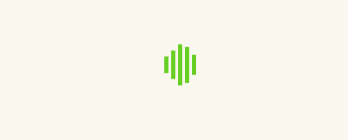
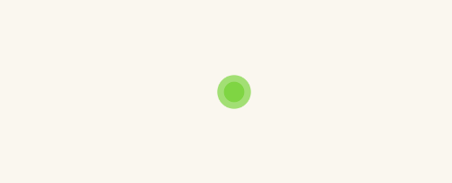
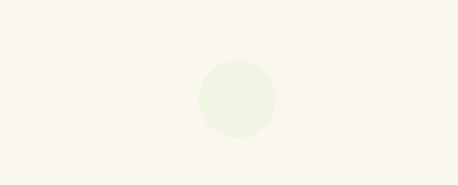
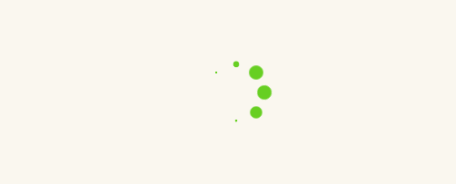

> **`实现下图四种Loading样式`**

- `要求`
    - `四种Loading样式写在同一个CSS文件`
    - `四种Loading展示在同一个Html文件`
    - `四种Loading采用BEM命名规范`
    - `使用Sass预处理语言`
    - `使用css-loader的CSS Module`
    - `使用Webpack模块打包器`
    - `CSS单独打包成css文件`
    
- `参考`
    - `第十九节webpack配置`