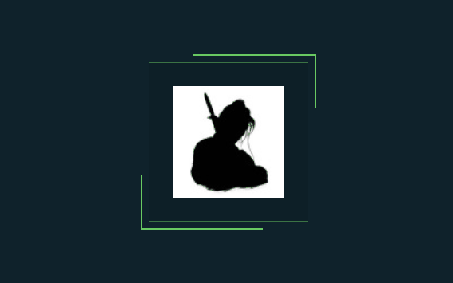
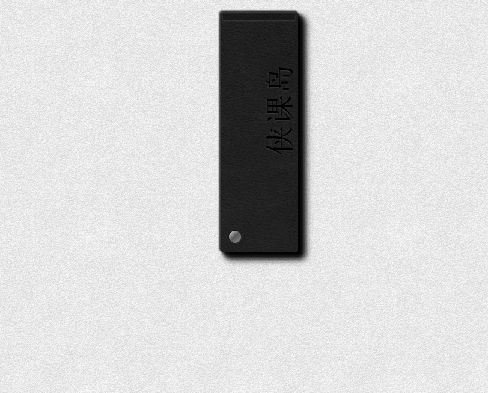
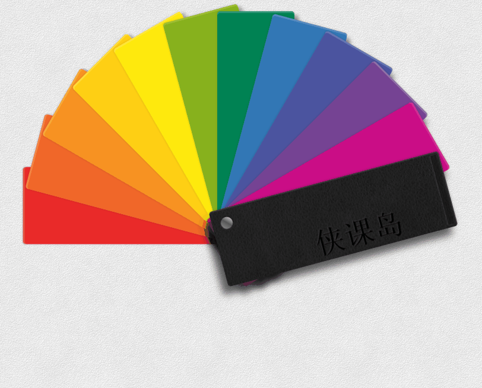
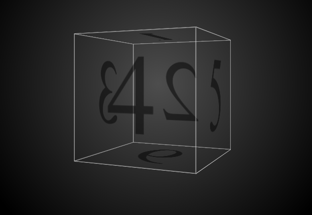
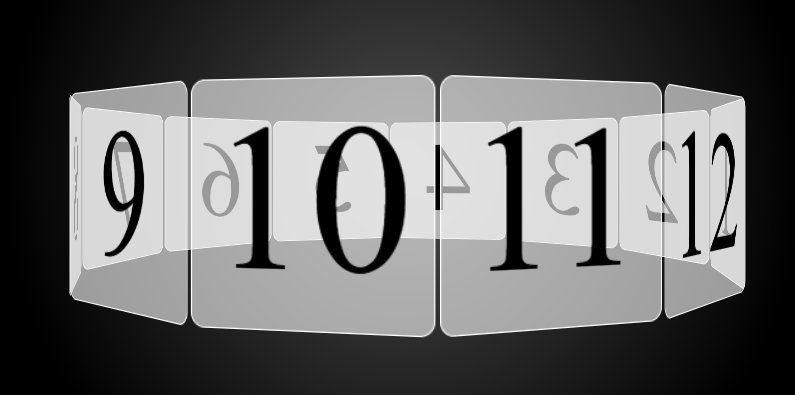

> **简答**
- @keyframes关键帧动画中如果不定义开始和结束状态会出现什么情况, 请先思考再实践尝试

- 按照自己的理解谈一谈CSS过渡动画与CSS关键帧动画的使用感受, 根据个人使用感受做一个简要对比

> **实操**
- `使用JS动画和CSS动画实现一个开关效果`

    

    - `最外层光晕可以忽略`
    - `中心圆：30px * 30px`
    - `中心圆padding：4px`
    - `最外层椭圆长度： 80px`
    - `鼠标点击拉长 - 中心圆宽度变为40px`
    - `选中颜色：#329FD9`

- `请实现下图效果`

    

    - `宽度：200px`
    - `线条宽度：2px`
    - `线条颜色： #62CA62`
    - `背景颜色： #0F222B`

- `使用CSS动画与JS动画实现下图效果`
    - `必做`
        - `颜色不做要求 - 着重与实现动画效果`
        - `以最左侧围基准 - 依次旋转角度15deg`

    

    - `选做`

    

    - `素材图片`

    
    

- `请实现下图效果`
    - `必做`

    - `尺寸：200px * 200px`

    - `旋转速度：45deg / s`

    

    - `选做`

    

- `请实现下图效果 (选做)`

  

> **优秀CSS动画效果欣赏**

