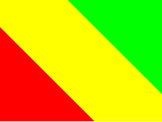
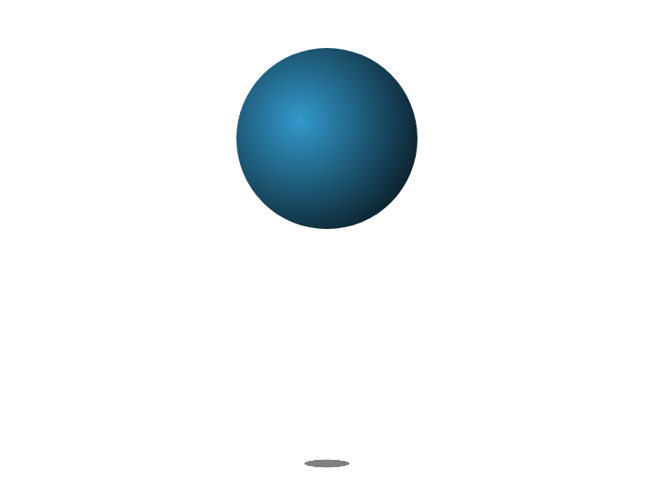
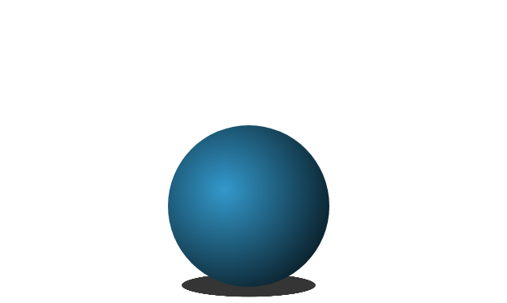

> **选择**

- FLex弹性盒模型子元素换行时会出现几根Main Axis
    ```css
    A: 保持1根

    B：随行数变化
    ```

- FLex弹性盒模型中Cross Axis会出现换行吗
    ```css
    A: 会

    B：不会

    ```

- FLex弹性盒模型子元素不压缩换行时Justify-content的Space-between是如何展现的
    ```css
    A: 跟随第一行子元素间距

    B：每行按照各自的剩余空间排列

    C: 出现Justify-content属性时不换行

    D: Space间距按照各行总的剩余间距排列
    ```

- FLex弹性盒模型中Stretch属性与元素高度height和宽度width的优先级关系是怎样的
    ```css
    A: stretch > width

    B：width > stretch

    C: stretch > height

    D: height > stretch
    ```


- 下面哪一个是Grid网格布局特有属性
    ```css
    A: justify-items

    B：align-items

    C：justify-content

    D：align-content
    ```

- CSS变换是基于
    ```css
    A: 透视投影 + 左手坐标系

    B：正交投影 + 左手坐标系

    C：透视投影 + 右手坐标系

    D：正交投影 + 右手坐标系
    ```

> **简答**
- Justify-items属性在FLex弹性盒模型与Grid网格布局中是相同的吗? 请按照自己的理解说明相同或不相同的理由

- 请简要说明CSS渐变为前端开发带来了哪些便利

- 请根据自己的理解简要对比Flex弹性盒模型与Grid网格布局, 说明二者的优劣

- 简要说明贝塞尔曲线图展现的速度关系

- 简要说明对Perspective属性的理解

> **实操**
- 请分别用CSS渐变角度和Transform实现下图样式, 并通过增加数量( 渲染100个或更多 )比较二者性能上的差异

    

    ```css
    width: 200px;
    height: 100px;
    color: red yellow green
    ```

- 请用Transition与Transform属性实现下图效果, 鼠标悬浮时背景整体向右移动100%, 呈现炫彩效果

    
    ```css
    背景颜色
    background-image: linear-gradient(
        to left,
        rgb(16, 121, 148),
        rgb(230, 211, 13) 25%,
        rgb(18, 136, 165) 50%,
        rgb(231, 213, 10) 75%,
        rgb(16, 121, 148)
    );
    仅文字背景
    background-size: 200% 100%;
    -webkit-text-fill-color: transparent;
    -webkit-background-clip: text;
    ```

- 使用CSS变换实现下图效果

    

    - `背景图片`

    

    ```css
    宽度：400px
    高度：130px
    ```

- 使用CSS变换实现下图效果

    

- 请结合CSS渐变、Transition与Transform实现小球鼠标悬浮自由落体效果
    - `小球有光晕效果, 下落时光晕点上移`

    - `下落过程大致符合自由落体速度关系`

    - `小球下落过程中影子不断增大`

    

    

    ```css
    小球半径: 200px
    径向渐变颜色：#39c, #000
    影子颜色: rgba(0,0,0,0.5)
    ```