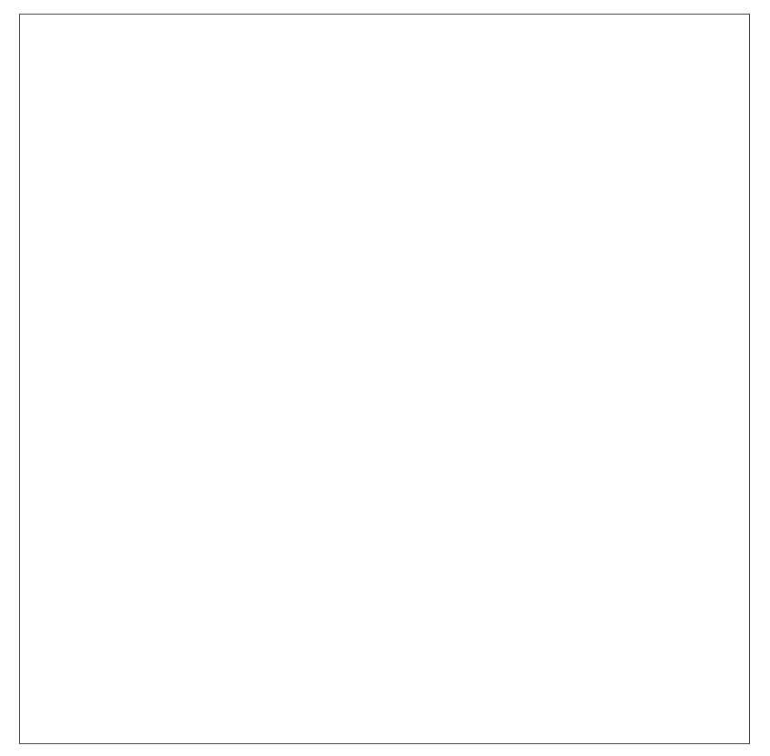
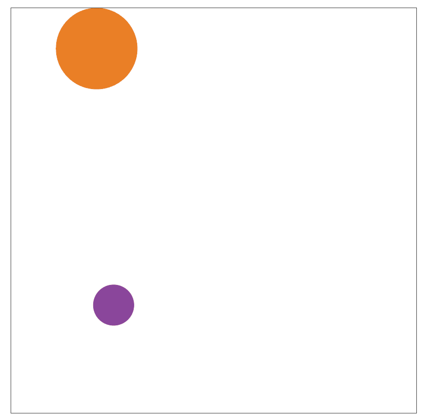
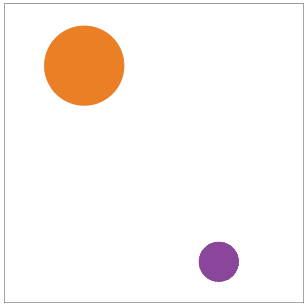
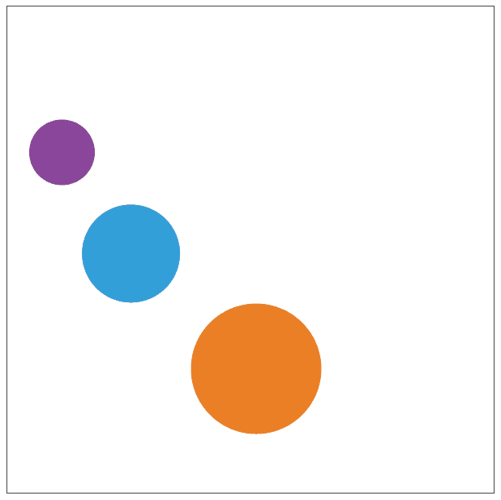
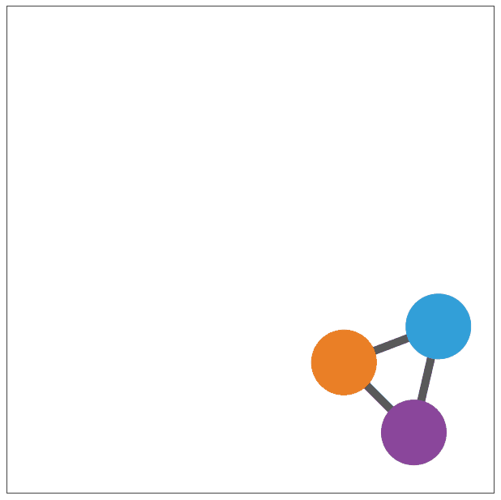

> **实操**
- `绘制两个运动的小球`

    

    - `Canvas 600px * 600px`

    - `大球 - 80px - #8A469B`

    - `小球 - 40px - #EA7F26`

    - `小球匀速运动 - 速度使用Math.random()`

    - `绘制球构造函数(参考)`
    ```css
    function Ball(radius, color){
        if(radius === undefined) {
            radius = 40;
        }
        if(color === undefined){
            color = '#00ff00';
        }
        this.x = 0;
        this.y = 0;
        this.vx = 0;
        this.vy = 0;
        this.radius = radius;
        this.rotation = 0;
        this.mass = 1;
        this.scaleX = 1;
        this.scaleY = 1;
        this.name = "";
        this.color = color;
        this.lineWidth = 1;
    }
    Ball.prototype.draw = function(ctx){
        ctx.save();
        ctx.translate(this.x, this.y);
        ctx.rotate(this.rotation);
        ctx.scale(this.scaleX, this.scaleY);
        ctx.lineWidth = this.lineWidth;
        ctx.fillStyle = this.color;
        ctx.strokeStyle = this.color;
        ctx.beginPath();
        ctx.arc(0, 0, this.radius, 0, Math.PI*2, false);
        ctx.closePath();
        ctx.fill();
        ctx.stroke();
        ctx.restore();
    }
    Ball.prototype.getBounds = function() {
        return {
            x: this.x - this.radius,
            y: this.y - this.radius,
            width: this.radius * 2,
            height: this.radius * 2
        };
    }
    ```

- `小球边界反弹`

    

    - `完全弹性碰撞 - 反弹系数为1`

    - `球体质量公式 - 4/3 * pi * R * R * R * 密度`

    - `v1 = [(m1-m2)v10 + 2m2v20] / (m1+m2)`

    - `v2 = [(m2-m1)v20 + 2m1v10] / (m1+m2)`

    - `墙壁质量认为无穷大 - 小球达到Canvas边界时x和y方向速度取反向`

- `小球碰撞检测`

    

    - `距离计算公式`

        

    - `速度分解 - 将速度分解为X方向与Y方向`

    - `分解后的速度遵循完全弹性碰撞`

    - `球体质量公式 - 4/3 * pi * R * R * R * 密度`

    - `v1 = [(m1-m2)v10 + 2m2v20] / (m1+m2)`

    - `v2 = [(m2-m1)v20 + 2m1v10] / (m1+m2)`

- `增加一个小球 - 半径60px - #329FD9`

    

- `小球半径统一为40px - 相距150px以内增加连线`

    

- `尝试制作下图效果`

    