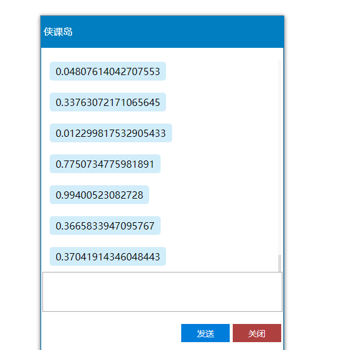

##  （二十六）SSE与WebSocket

> **`1：基本概念`**

- `广义短连接`
```css
建立连接 —— 数据传输 —— 关闭连接

建立连接 —— 数据传输 —— 关闭连接
```

- `广义长连接`
```css
建立连接
数据传输
...
...
关闭连接
```

- `单个 TCP 连接上全双工通讯协议 - 允许服务端主动向客户端推送数据`

- `SSE(Server-Sent Events) - WebSocket 轻量代替方案`

> **`2：浏览器兼容`**


> **`3：SSE与WebSocket`**
- `WebSocke`
    - `全双工通道, 可以双向通信`
    - `全新协议, 需要服务器端支持`
    - `不会主动断开`

- `SSE`
    - `单向通道,服务端向客户端推送`
    - `部署在HTTP协议之上, 都支持`
    - `支持自定义数据类型`
    - `轻量级协议`
    - `静置 15 秒后自动断开(草案标准)`

> **`4：基本用法`**
- `建立连接`
    ```css
    const SSEClient = new EventSource('http://localhost:3000/sse');

    SSEClient.addEventListener('open', () => {
        console.log('连接成功！');
    }, false);
    ```

> **`5：数据格式`**
- `纯文本的简单协议`

- `包含回车符和换行符的空行来分隔`
    ```css
    data: Hello

    data: Word
    id: 1

    event: eventName
    data: Hello
    data: Word
    id: 2
    ```

- `数据类型`
    - `空白 - :开头 - 作为注释忽略 - 维持服务器和客户端的长连接`
    - `data - data开头`
    - `id - 事件的标识符 - 重连标识(Last-Event-ID)`
    - `event - 消息事件类型 - 没有event字段默认触发messages事件 - 自定义事件不会触发message`
    - `retry - 重连等待时间(ms) - 只接受整数`

    ```css
    SSEClient.addEventListener('connecttime', event => {
        console.log('connecttime data', event.data);
    }, false);

    SSEClient.addEventListener('message', event => {
        console.log('message data', event.data);
    }, false);
    ```

> **`6：错误处理`**
```css
SSEClient.onerror = error => console.error('连接出错！', error);
```

> **`7：关闭连接`**
```css
SSEClient.close();
```

> **`8：只读属性`**
- `readyState`
    - `0 CONNECTING `
    - `1 OPEN`
    - `2 CLOSED`
    ```css
    SSEClient.readyState
    ```
- `url`
    ```css
    SSEClient.url
    ```

> **`9：注意事项`**
- `数据完整性 - Last-Event-ID`

- `减少网络开销 - 必要时断开连接`

> **`10：课后练习`**

- `实现一个实时聊天系统`

    

    - `要求`
    ```css
    样式参考上图但不做限制, 鼓励添加动画实现更好的效果

    cmd进入server运行node bin/www

    SSE调用地址 - http://localhost:3000/sse
    ```

> **`11：总结`**
```css
本节课从广义上的网页长连接入手，介绍了WebSocket与SSE的主要特点, 重点介绍了SSE的使用方法, 最后结合课后练习展示了SSE与WebSocket最典型的应用场景
```