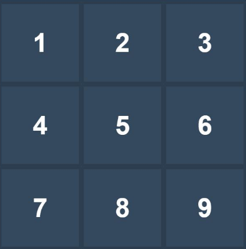
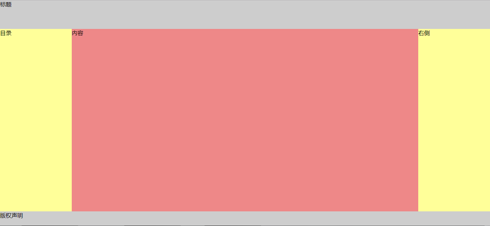

##  （十）Grid网格布局 (下)

> **`4：Grid容器成员 (Grid Item) 属性`**
   ```css
	grid-column-start

	grid-column-end

	grid-row-start

	grid-row-end

	grid-column

	grid-row

	grid-area

	justify-self

	align-self
  ```
- **`grid-column-start/end (根据网格线确定Grid Item位置)`**
  	- `number`
	- `name`
	- `span number`
	- `span name`
  ```css
    .main {
	    display: grid;
	    grid-template-columns: 100px 100px 100px;
        grid-template-rows: 100px 100px 100px;
    }
	.item {
		grid-column-start: 2;
		grid-column-end: span 4;
	}
  ```

- **`grid-row-start/end (根据网格线确定Grid Item位置)`**
  	- `number`
	- `name`
	- `span number`
	- `span name`
  ```css
    .main {
	    display: grid;
	    grid-template-columns: 100px 100px 100px;
        grid-template-rows: 100px 100px 100px;
    }
	.item {
	    grid-row-start: span 2;
	    grid-row-end: 4;
	}
  ```

- **`grid-column/row (grid-column/row-start/end简写)`**

  ```css
    .main {
	    display: grid;
	    grid-template-columns: 100px 100px 100px;
        grid-template-rows: 100px 100px 100px;
    }
	.item {
	    grid-column: span 2 / 4;
	    grid-row: 1 / 4;
	}
  ```

- **`grid-area (创建区域)`**
  - `命名引用`
    ```css
	grid-area: name;
	```

  - `直接定义`
	```css
	grid-area: name | row-start | column-start | row-end | column-end
	```
  ```css
    .main {
	    display: grid;
	    grid-template-columns: 100px 100px 100px;
        grid-template-rows: 100px 100px 100px;
    }
	.item {
	    grid-area: item;
	    grid-area: 3 / 1 / 4 / 6;
	}
  ```

- **`justify-self (元素在Grid Cell横轴上的对齐方式 - 只对单个元素生效)`**
    - `start`
	- `end`
	- `center`
	- `stretch`
  ```css
    .main {
	    display: grid;
	    grid-template-columns: 100px 100px 100px;
        grid-template-rows: 100px 100px 100px;
    }
	.item {
	    justify-self: start;
	}
  ```

- **`align-self (元素在Grid Cell纵轴上的对齐方式 - 只对单个元素生效)`**
    - `start`
	- `end`
	- `center`
	- `stretch`
  ```css
    .main {
	    display: grid;
	    grid-template-columns: 100px 100px 100px;
        grid-template-rows: 100px 100px 100px;
    }
	.item {
	    align-self: start;
	}
  ```

> **`5：Grid网格布局注意事项`**

  - `Grid网格布局适用于页面整体布局`

  - `Grid容器成员float、table-cell、inline-block属性无效`
  - `不推荐中文命名, 中文命名会导致name无法匹配`

> **`6：课后练习`**
- Grid Cell与Grid Area的关系是
	```css
	A: 并集关系

	B: 子集关系

	C：交集关系

	```
- 与 grid-template-columns: 1fr 1fr 1fr 等效的是
	```css
	A: grid-template-columns: auto auto auto

	B: grid-template: auto auto auto / 100px 100px 100px

	C: grid-template: 100px 100px 100px / auto auto auto

	D: grid: auto auto auto / 100px 100px 100px
	```

- 与图片中数字6对应的区域是

	
	```css
	A: grid-area: 1 / 2 / 2 / 3

	B: grid-area: 2 / 3 / 3 / 4

	C: grid-area: 2 / 3 / 4 / 3

	D: grid-area: 1 / 2 / 3 / 4
	```

- 谈谈对CSS一维布局和二维布局的理解

- 使用Grid网格布局方式实现双飞燕布局, 要求使用尽量少的代码 (评选出最佳布局)
	```css
    table
    div
    flex
    grid
    ```
    
    ```css
    header
        height: 80px;
        background-color: #cdcdcd;

    left
        width: 200px;
        background-color: #ffff99;

    center
        width: auto;
        background-color: #ee8888;

    right
        width: 200px;
        background-color: #ffff99;

    footer
        height: 40px;
        background-color: #cdcdcd;
    ```

- 使用Grid网格布局方式实现下图布局, 要求文字垂直居中对齐, 使用尽量少的代码实现

	

	```css
	蓝色：#02BCD4
	绿色：#019688
	紫色：#673AB7

	最小方格尺寸：60px * 60px
	字体大小：8px
	```

> **`7：总结`**

```
本节课讲解了Grid网格布局的基本概念, 重点介绍了Grid Container十四个常用属性以及Grid Item的九个常用属性
```