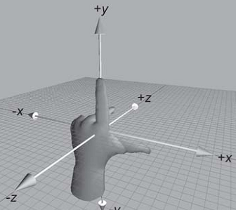
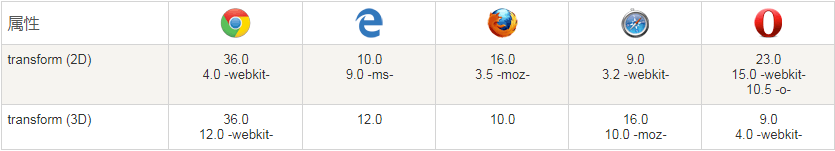
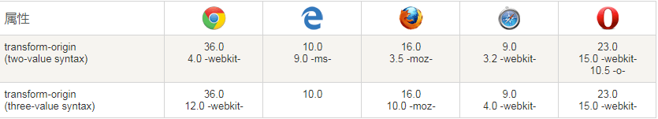
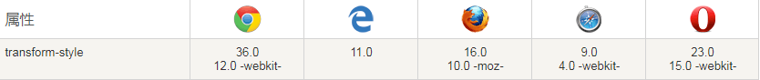

##  （十一）Transform变换

> **`1：基本概念 (Grid Layout)`**

- **`应用于元素的2D或3D转换`**

- **`允许将元素旋转，缩放，移动，倾斜`**

- **`坐标系` - 左手坐标系**

    

- **`Transform-origin` - 基准点**

- **`Transform-style` - 元素呈现方式**

- **Rotate - 旋转**

- **Scale - 缩放**

- **Skew - 倾斜**

- **Translate - 移动**

> **`2：浏览器兼容`**
- **完全支持Transform第一个浏览器版本**

	

- **完全支持Transform-origin第一个浏览器版本**

	

- **完全支持Transform第一个浏览器版本**

	

> **`3：Rotate`**
- `rotate(angle)` - 2D 旋转

    ```css
    transform: rotate(45deg);
    ```

- `rotateX(angle)` - 沿X轴3D旋转 

    ```css
    transform: rotateX(45deg);
    ```

- `rotateY(angle)` - 沿Y轴3D旋转 

    ```css
    transform: rotateY(45deg);
    ```
- `rotateZ(angle)` - 沿Z轴3D旋转 

    ```css
    transform: rotateZ(45deg);
    ```

- `rotate3d(x, y, z, angle)` - 3D旋转
    - x y z - 介于0-1之间, 确定三维空间唯一坐标点

    - angle - 围绕原点与x y z坐标点连线的旋转角度

    - 欧拉角与四元数 (了解)

    ```css
    transform: rotate3d(1, 1, 1, 45deg);
    ```

> **`4：Scale`**
- `scale(x[, y])` - 2D 缩放

    ```css
    transform: scale(2);
    ```

- `scaleX(x)` - 沿X轴缩放

    ```css
    transform: scaleX(2);
    ```

- `scaleY(y)` - 沿Y轴缩放

    ```css
    transform: scaleY(2);
    ```

- `scaleZ(z)` - 沿Z轴缩放

    ```css
    transform: scaleZ(2);
    ```


- `scale3d(x, y, z)` - 定义每个方向上的缩放
    ```css
    transform: rotate(2, 2, 2);
    ```

