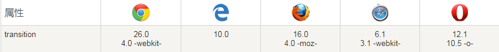

##  （十二）Transition过渡

> **`1：基本概念`**

- **`在一定时间区间内平滑地过渡(圆滑地以动画效果改变CSS的属性值)`**

- **`鼠标单击、获得焦点、被点击或对元素改变中触发`**

- **`Transition-duration` - 过渡时间**

- **`Transition-property` - 过渡 CSS 属性名称**

- **`Transition-delay` - 过渡开始时间**

- **`Transition-timing-function` - 过渡效果时间曲线**

- **`Transition` - 简写(设置四个属性)**

> **`2：浏览器兼容`**
- **完全支持Transform第一个浏览器版本**

	

> **`3：Transition-duration`**
  ```css
  transition-duration: s | ms;
  ```
- `必须搭配transition-property同时使用`

- `默认值` - 0

> **`5：Transition-duration`**
  ```css
  transition-duration: s | ms;
  ```
- `必须搭配transition-property同时使用`

- `默认值` - 0

> **`4：Transition-property`**
  ```css
  transition-property: none | all | property;
  ```
- `默认值` - all

- `必须搭配transition-duration同时使用`

- `none` - 没有过渡效果(突变)

  ```css
  transition-property: none;
  ```

- `all` - 所有属性获取过渡效果

    ```css
    transition-property: all;
    ```

- `property` - 特定属性获得过渡效果 (多个属性用逗号隔开)

    ```css
    transition-property: width, height;
    ```

- `所有支持属性`
    ```css
    background-color
    background-position
    border-color
    border-width
    border-spacing
    bottom
    clip
    color
    crop
    font-size
    font-weight
    height
    left
    letter-spacing
    line-height
    margin
    max-height
    max-width
    min-height
    min-width
    opacity
    outline-color
    outline-offset
    outline-width
    padding
    right
    text-indent
    text-shadow
    top
    vertical-align
    visibility
    width
    word-spacing
    z-index
    ```

> **`5：Transition-duration`**
  ```css
  transition-duration: s | ms;
  ```
- `必须搭配transition-property同时使用`

- `默认值` - 0

> **`5：Transition-delay`**
  ```css
  transition-delay: s | ms;
  ```

- `默认值` - 0

> **`6：Transition-timing-function`**
  ```css
  transition-timing-function: linear | ease | ease-in | ease-out | ease-in-out | cubic-bezier(n,n,n,n);
  ```

- `默认值` - linear

- `linear` - 以相同速度过渡

- `ease` - 慢速开始 -> 变快 -> 慢速结束

- `ease-in` - 慢速开始

- `ease-out` - 慢速结束

- `ease-in-out` - 慢速开始、慢速结束、幅度比ease大

- `cubic-bezier(n, n, n, n)` - 自定义速度函数 (n介于0和1)


> **`5：Skew`**
- `skewX(angle)` - 沿 X 轴的 2D 倾斜

    ```css
    transform: skewX(45deg);
    ```

- `skewY(angle)` - 沿 Y 轴的 2D 倾斜

    ```css
    transform: skewY(45deg);
    ```

- `skew(angle-x, angle-y)` - 沿 X Y 轴的 2D 倾斜

    ```css
    transform: skewY(45deg, 45deg);
    ```

> **`6：Translate`**

- `translateX(x)` - 沿 X 轴位移

    ```css
    transform: translateX(20px);
    ```

- `translateY(y)` - 沿 Y 轴位移

    ```css
    transform: translateY(20px);
    ```

- `translateZ(z)` - 沿 Z 轴位移

    ```css
    transform: translateZ(20px);
    ```

- `translate(x, y)` - 沿 X Y 轴位移

    ```css
    transform: translate(20px, 20px);
    ```

- `translate3d(x, y, z)` - 沿 X Y Z 轴位移

    ```css
    transform: translate(20px, 20px, 20px);
    ```

> **`7：Perspective` - 视觉和元素3D空间Z平面之间的距离**

```css
transform: perspective(200px);
```

> **`8：Transform-origin` - 基准点**
  - `基本语法`
    ```css
    transform-origin: x-axis y-axis z-axis;
    ```
  - `默认值`  -  `50% 50% 0`

  - `x-axis`
    - `left`
    - `center`
    - `right`
    - `length`
    - `%`

  - `y-axis`
    - `top`
    - `center`
    - `bottom`
    - `length`
    - `%`

  - `z-axis`
    - `length`

> **`9：Transform-style` - 三维空间呈现形式**

  - `flat` - `2D形式`

  - `preserve-3d` - `3D形式`

> **`10：课后练习`**

- **`CSS中Transform采用哪种投影, 有什么特点`**
    ```css
    A: 正交投影

    B: 透视投影
    ```

- **`尝试使用Transform实现下图样式`**

    
    ```css
    image宽度 300px
    image高度 220px
    
    image padding 10px

    倾斜角度不限制, 协调即可
    ```


- **`使用Flex布局结合Transform实现下图样式`**

    

    ```css
    边长 400px * 400px

    紫色背景 #8A469B

    棱(边) #CDCDCD

    点数 #000

    面 #FFF
    ```

- **`尝试使用Transform实现下图样式 (选做)`**

    

> **`11：总结`**

    ```
    本节课讲解了Transform的基本概念, 简要介绍了CSS3坐标系统与透视原理, 重点介绍了Transform常用的Rotate(旋转)、Scale(缩放)、Skew(倾斜)、Translate(移动)、Perspective(透视)属性
    ```