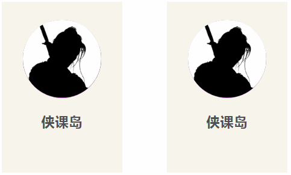
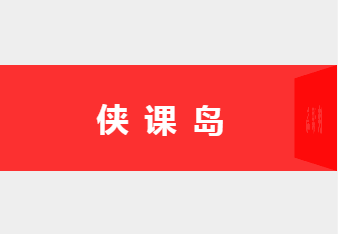

##  （十三）Transition过渡(下)

> **`8：悬浮菜单栏特效`**

- `拉伸展开`

  

    - `初始状态`
    ```css
    .origin1 {
        opacity: 0;
        transform: rotateY(90deg);
        transform-origin: center;
        transition-property: all;
    }
    ```

    - `结束状态`
    ```css
    .main li:hover .menu1 :nth-child(1) {
        opacity: 1;
        transition-duration: .5s;
        transition-delay: .3s;
        transform: rotateY(0);
    }

    .main li:hover .menu1 :nth-child(2) {
        opacity: 1;
        transition-duration: .5s;
        transition-delay: .6s;
        transform: rotateY(0);
    }

    .main li:hover .menu1 :nth-child(3) {
        opacity: 1;
        transition-duration: .5s;
        transition-delay: .9s;
        transform: rotateY(0);
    }

    .main li:hover .menu1 :nth-child(4) {
        opacity: 1;
        transition-duration: .5s;
        transition-delay: 1.2s;
        transform: rotateY(0);
    }
    ```

- `旋转移入`

  

  - `初始状态`
  ```css
  .origin2 {
        opacity: 0;
        transform: translateX(50px) rotate(-90deg);
        transform-origin: top center;
        transition-property: all;
    }
  ```

  - `结束状态`
  ```css
  .main li:hover .menu2 :nth-child(1) {
        opacity: 1;
        transform: translateX(0) rotate(0);
        transition-duration: .5s;
        transition-delay: .3s;
    }

    .main li:hover .menu2 :nth-child(2) {
        opacity: 1;
        transform: translateX(0) rotate(0);
        transition-duration: .5s;
        transition-delay: .6s;
    }

    .main li:hover .menu2 :nth-child(3) {
        opacity: 1;
        transform: translateX(0) rotate(0);
        transition-duration: .5s;
        transition-delay: .9s;
    }

    .main li:hover .menu2 :nth-child(4) {
        opacity: 1;
        transform: translateX(0) rotate(0);
        transition-duration: .5s;
        transition-delay: 1.2s;
    }
  ```

> **`9：悬浮卡片特效`**

  

- `下拉幕布`
```css
.avatar:before {
    position: absolute;
    bottom: 100%;
    content: "";
    width: 100%;
    height: 0;
    border-radius: 50%;
    background: #8A469B;
    opacity: 0.2;
    transform: scale(3);
    transition: all 0.3s linear 0s;
}
.avatar:hover:before {
    height: 100%;
}
```
- `紫色外边框`
```css
.avatar:after {
    position: absolute;
    top: 0;
    left: 0;
    content: "";
    width: 100%;
    height: 100%;
    border-radius: 50%;
    background: #8A469B;
    z-index: -1;
}
```
- `图片外环`
```css
.avatar img {
    width: 100%;
    height: auto;
    border-radius: 50%;
    transform: scale(1);
    transition: all 0.9s ease 0s;
}
.avatar:hover img {
    box-shadow: 0 0 0 14px #FFFFFF;
    transform: scale(0.7);
}
```
- `图片替换`
```css
.teacher3 {
    position: absolute;
    left: 0;
    top: 0;
    opacity: 0;
}
.team:hover .teacher3 {
    opacity: 1;
    transform: scale(0.7);
}
```

> **`10：3D效果`**

> **`11：Transition特点`**
- `简单易用`
- `需要事件触发, 无法自动发生`
- `一次性的, 不能重复`
- `只能定义开始状态和结束状态, 不能定义中间状态`

> **`12：课后练习`**

- **`使用Transform和Transition实现下图效果`**

    

    

- **`使用Transform和Transition实现下图效果`**

    

> **`13：总结`**

```css
本节课介绍了Transition的基本概念, Transition相关的数学基础, 在此基础上介绍了duration、property、delay、timing-function常用属性, 最后结合常见实例分析Transition的优缺点
    
```