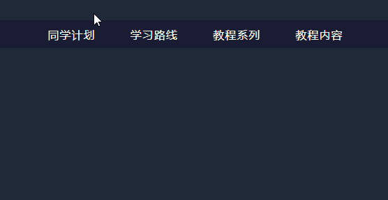

##  （十三）Transition过渡(下)

> **`8：悬浮菜单栏特效`**

- `拉伸展开`

  

    - `初始状态`
    ```css
    .origin1 {
        opacity: 0;
        transform: rotateY(90deg);
        transform-origin: center;
        transition-property: all;
    }
    ```

    - `结束状态`
    ```css
    .main li:hover .menu1 :nth-child(1) {
        opacity: 1;
        transition-duration: .5s;
        transition-delay: .3s;
        transform: rotateY(0);
    }

    .main li:hover .menu1 :nth-child(2) {
        opacity: 1;
        transition-duration: .5s;
        transition-delay: .6s;
        transform: rotateY(0);
    }

    .main li:hover .menu1 :nth-child(3) {
        opacity: 1;
        transition-duration: .5s;
        transition-delay: .9s;
        transform: rotateY(0);
    }

    .main li:hover .menu1 :nth-child(4) {
        opacity: 1;
        transition-duration: .5s;
        transition-delay: 1.2s;
        transform: rotateY(0);
    }
    ```

- `旋转移入`

  

  - `初始状态`
  ```css
  .origin2 {
        opacity: 0;
        transform: translateX(50px) rotate(-90deg);
        transform-origin: top center;
        transition-property: all;
    }
  ```

  - `结束状态`
  ```css
  .main li:hover .menu2 :nth-child(1) {
        opacity: 1;
        transform: translateX(0) rotate(0);
        transition-duration: .5s;
        transition-delay: .3s;
    }

    .main li:hover .menu2 :nth-child(2) {
        opacity: 1;
        transform: translateX(0) rotate(0);
        transition-duration: .5s;
        transition-delay: .6s;
    }

    .main li:hover .menu2 :nth-child(3) {
        opacity: 1;
        transform: translateX(0) rotate(0);
        transition-duration: .5s;
        transition-delay: .9s;
    }

    .main li:hover .menu2 :nth-child(4) {
        opacity: 1;
        transform: translateX(0) rotate(0);
        transition-duration: .5s;
        transition-delay: 1.2s;
    }
  ```


- **`在一定时间区间内平滑地过渡(圆滑地以动画效果改变CSS的属性值)`**

- **`鼠标单击、获得焦点、被点击或对元素改变中触发`**

- **`Transition-duration` - 过渡时间**

- **`Transition-property` - 过渡 CSS 属性名称**

- **`Transition-delay` - 过渡开始时间**

- **`贝塞尔曲线`**

- **`Transition-timing-function` - 过渡效果时间曲线**

- **`Transition` - 简写(设置四个属性)**

> **`2：浏览器兼容`**
- **完全支持Transform第一个浏览器版本**

	

> **`3：Transition-duration`**
  ```css
  transition-duration: s | ms;
  ```
- `必须搭配transition-property同时使用`

- `默认值` - 0

> **`5：Transition-duration`**
  ```css
  transition-duration: s | ms;
  ```
- `必须搭配transition-property同时使用`

- `默认值` - 0

> **`4：Transition-property`**
  ```css
  transition-property: none | all | property;
  ```
- `默认值` - all

- `必须搭配transition-duration同时使用`

- `none` - 没有过渡效果(突变)

  ```css
  transition-property: none;
  ```

- `all` - 所有属性获取过渡效果

    ```css
    transition-property: all;
    ```

- `property` - 特定属性获得过渡效果 (多个属性用逗号隔开)

    ```css
    transition-property: width, height;
    ```

- `所有支持属性`
    ```css
    background-color
    background-position
    border-color
    border-width
    border-spacing
    bottom
    clip
    color
    crop
    font-size
    font-weight
    height
    left
    letter-spacing
    line-height
    margin
    max-height
    max-width
    min-height
    min-width
    opacity
    outline-color
    outline-offset
    outline-width
    padding
    right
    text-indent
    text-shadow
    top
    vertical-align
    visibility
    width
    word-spacing
    z-index
    ```

> **`5：Transition-duration`**
  ```css
  transition-duration: s | ms;
  ```
- `必须搭配transition-property同时使用`

- `默认值` - 0

> **`5：Transition-delay`**
  ```css
  transition-delay: s | ms;
  ```

- `默认值` - 0

> **`6：贝塞尔曲线`**
- `应用于二维图形应用程序的数学曲线`

- `绘制贝塞尔曲线`

    

    

    

    

    

    

- `函数形式的贝塞尔曲线`

    - 一阶贝塞尔曲线

      

      

    - 二阶贝塞尔曲线

      

      

    - 三阶贝塞尔曲线

      

      

- `cubic-bezier(n1, n2, n3, n4)`
    - P0 (0, 0)
    - P1 (1, 1)
    - P3 (n1, n2)
    - P4 (n3, n4)

- `曲线上点的切线对应运动速度`

- `http://cubic-bezier.com/` - 可视化cubic-bezier编辑

> **`7：Transition-timing-function`**
  ```css
  transition-timing-function: linear | ease | ease-in | ease-out | ease-in-out | cubic-bezier(n1, n2, n3, n4);
  ```

- `默认值` - ease

- `n1、n2、n3、n4取值` - 官方推荐(0 - 1) - 实际浏览器已经完全支持

- `linear` - 以相同速度过渡 - cubic-bezier(0, 0, 1, 1) / cubic-bezier(1, 1, 0, 0)

    

- `ease` - 慢速开始 -> 变快 -> 慢速结束 - cubic-bezier(0.25, 0.1, 0.25, 1)

    

- `ease-in` - 慢速开始 - cubic-bezier(0.42, 0, 1, 1)

    

- `ease-out` - 慢速结束 - cubic-bezier(0, 0, 0.58, 1)

    

- `ease-in-out` - 慢速开始、慢速结束、幅度比ease大 - cubic-bezier(0.42, 0, 0.58, 1)

    

- `cubic-bezier(n, n, n, n)` - 自定义速度函数 (n介于0和1)
