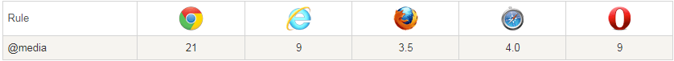
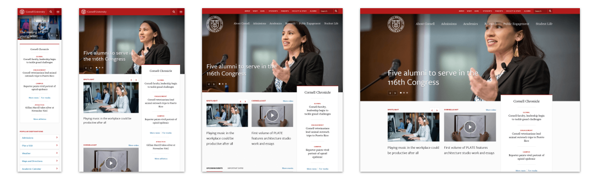

##  （十四）媒体查询及响应式

> **`1：基本概念`**

- `根据一个或多个基于设备类型、具体特点和环境的媒体查询来应用样式`

    - `针对不同的媒体类型定义不同的样式`

    - `可以针对不同的屏幕尺寸设置不同的样式`

    - `实现响应式页面`

> **`2：浏览器兼容`**
- **完全支持Transition第一个浏览器版本**

	

> **`3：语法`**
- `优先级 - 遵循CSS层叠样式规则`
```css
@media mediatype and|not|only (media feature) {
    CSS-Code;
}
```
```css
<link rel="stylesheet" media="mediatype and|not|only (media feature)" href="mystylesheet.css">
```

> **`4：媒体类型`**

- `all - 所有设备`
    ```css
    @media all and|not|only (media feature) {
        CSS-Code;
    }
    ```

- `screen - 电脑屏幕，平板电脑，智能手机`
    ```css
    @media screen and|not|only (media feature) {
        CSS-Code;
    }
    ```

- `print - 打印机和打印预览`
    ```css
    @media print and|not|only (media feature) {
        CSS-Code;
    }
    ```

- `speech - 屏幕阅读器等发声设备`
    ```css
    @media speech and|not|only (media feature) {
        CSS-Code;
    }
    ```

> **`5：运算符`**
- `and`
```css
    @media screen and (max-width: 600px) {
        CSS-Code;
    }
```

- `not`
```css
    @media not screen {
        CSS-Code;
    }
```

- `only`
```css
    @media only screen {
        CSS-Code;
    }
```
- `, - 或`
```css
    @media print , (max-width : 600px) {
        CSS-Code;
    }
```

> **`6：媒体功能`**
- `width / height`
```css
    @media screen and (width : 600px) , (width : 800px) {
        CSS-Code;
    }
```
- `min-width / min-height`
```css
    @media screen and (min-width : 600px) {
        CSS-Code;
    }
```
- `max-width / max-height`
```css
    @media screen and (max-width : 600px) {
        CSS-Code;
    }
```
- `device-height - 屏幕可见高度`
- `min-device-height`
- `max-device-height`
- `device-width - 屏幕可见宽度`
- `max-device-width`
- `min-device-width`
- `(color: 8) - 每一组彩色原件的个数`
- `max-color`
- `min-color`
- `(color-index: 1500) - 设备的彩色查询表条目数`
- `max-color-index`
- `min-color-index`
- `(orientation: landscape) - 横纵`
- `(monochrome: 0) - 一个单色框架缓冲区中每像素包含的单色原件个数`
- `min-monochrome`
- `max-monochrome`
- `(grid: 1) - 是否使用栅格或点阵`
- `(scan: interlace) - 扫描工序`
- `(device-aspect-ratio: 8/5) - 屏幕可见区域宽高比`
- `min-device-aspect-ratio`
- `max-device-aspect-ratio`
- `(aspect-ratio: 8/5) - 页面可见区域宽高比`
- `min-aspect-ratio`
- `max-aspect-ratio`
- `(resolution: 996dpi)- 分辨率`
- `min-resolution`
- `max-resolution`

> **`7：媒体查询与响应式布局`**

  

  

- `常见的自适应布局方式`


> **`8：课后练习`**
- 使用CSS媒体查询结合Transition与Transform实现响应式菜单栏

    
    ```css
    背景颜色 rgb(73, 74, 95)
    菜单栏背景颜色 #8A469B
    左侧划出菜单栏背景颜色 #222

    鼠标悬浮左侧菜单划出
    变换三角采用三条高度5px的div元素，悬浮旋转45deg

    800px时菜单栏转换
    ```
> **`9：总结`**

```css
本节课介绍了媒体查询的基本概念, 讲解了媒体类型、运算符和媒体功能的常用属性, 最后介绍了媒体查询与响应式布局的相关内容
    
```