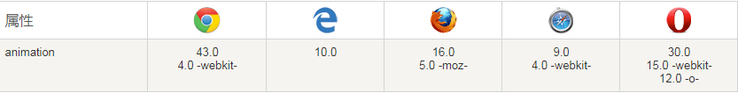

##  （十五）CSS动画

> **`1：基本概念`**

- **`过渡动画 - Transition`**
	- `初始状态` 过渡到 `结束状态` 所产生的动画

	- `只能定义初始和结束两个状态`

	- `最简单的CSS动画`

	- `被动触发`

	- `不能重复发生`

- **`关键帧动画 - Animation - @keyframes `**
	```css
	@keyframes 动画名称 {
	    时间点 { 元素状态 }
	    时间点 { 元素状态 }
	    时间点 { 元素状态 }
	    时间点 { 元素状态 }
	    …
	}
	```

	- `可以定义多个状态`

	- `更复杂的动画效果`

	- `可以主动触发`

	- `可以重复发生`

> **`2：浏览器支持`**
  - **完全支持该属性的第一个浏览器版本**

    

> **`3：基本语法`**

```css
.main {
    animation: animationname duration timing-function delay iteration-count direction fill-mode play-state;
}


@keyframes animationname {
    from { css-code }
    to { css-code }

    0% - 100% { css-code }
}
```

> **`4：animationname - 关键帧名称`**
```css
.main {
    animation-name: around;
    animation-duration: 5s;
    animation-iteration-count: infinite;
}

@keyframes around {
    from { css-code }
    to { css-code }

    0% - 100% { css-code }
}
```

> **`5：duration - 动画持续时间`**

- `单位 s / ms`

```css
.main {
    animation-name: around;
    animation-duration: 500ms;
    animation-iteration-count: infinite;
}

@keyframes around {
    from { css-code }
    to { css-code }

    0% - 100% { css-code }
}
```

> **`6：timing-function - 时间函数曲线`**

```css
.main {
    animation-name: around;
    animation-duration: 5s;
    animation-iteration-count: infinite;
    animation-timing-function: cubic-bezier(0.075, 0.82, 0.165, 1);
}
```

- `时间区间 两套CSS样式之间`

- `linear`

- `ease`

- `ease-in`

- `ease-out`

- `ease-in-out`

- `cubic-bezier(n, n, n, n)`

> **`7：delay - 动画开始延迟时间`**

- `单位 s / ms`

- `仅定义第一次开始延迟时间`

```css
.main {
    animation-name: around;
    animation-duration: 5s;
    animation-iteration-count: infinite;
    animation-timing-function: cubic-bezier(0.075, 0.82, 0.165, 1);
	animation-delay: 3s;
}
```

> **`8：iteration-count - 动画播放次数`**

```css
.main {
    animation-name: around;
    animation-duration: 5s;
    animation-iteration-count: infinite;
    animation-timing-function: cubic-bezier(0.075, 0.82, 0.165, 1);
    animation-delay: 3s;
}
```

- `n - 具体的播放次数`

- `infinite - 无限循环`

> **`9：direction - 动画播放方向`**

```css
.main {
    animation-name: around;
    animation-duration: 5s;
    animation-iteration-count: infinite;
    animation-timing-function: cubic-bezier(0.075, 0.82, 0.165, 1);
    animation-delay: 3s;
    animation-direction: alternate;
}
```

- `normal - 正常播放`

- `reverse - 反向播放`

- `alternate - 奇数次正向, 偶数次反向`

- `alternate-reverse - 偶数次正向, 奇数次反向`

> **`10：fill-mode`**

> **`11：play-state`**

> **`4：课后练习`**
- Flex container存在下列哪几个描述, 分别代表什么
	```css
	A : Main axis
	B : Cross axis
	C : Row axis
	D ：Column axis
	```
- Flex item存在下列哪几个描述, 分别代表什么
	```css
	A : Main size
	B : Cross size
	C : Row size
	D ：Column size
	```
- item元素的实际宽度是多少
	```css
	.main {
	    display: flex;
	}
	.main .item {
	    flex-basis: 200px;
	    width: 100px;
	} 
	```
- Flex container具有哪几个属性, 分别代表什么

- Flex item具有哪几个属性, 分别代表什么

- class为two的容器宽度是多少? 并说明原因 (实操)
	```css
	.main {
	    display: flex;
	    background: #8A469B;
	}
	.main span{
	    width: 800px;
	    height: 50px;
	    border: 1px solid #FFF;
	    box-sizing: border-box;
	    background: #EA7F26;
	}
	.zero {
	    flex-shrink: 0;
	}
	.one {
	    flex-shrink: 1;
	}
	.two {
	    flex-shrink: 9;
	}

	<div class="main">
        <span class="zero">1</span>
        <span class="one">2</span>
        <span class="two">3</span>
    </div>
	```

- 计算出各个 li 元素实际宽度 (计算)
	```css
	.main {
	    display: flex;
	    width: 400px;
	    margin: 0;
	    padding: 0;
	    list-style: none;
	}
	.main li {
	    width: 200px;
	}
	.main li:nth-child(1) {
	    background: #888;
	}
	.main li:nth-child(2) {
	    background: #ccc;
	}
	.main li:nth-child(3) {
	    flex-shrink: 3;
	    background: #aaa;
	}
	```

> **`5：总结`**

```
本节课讲解了Flex弹性盒模型的基本概念, 简要介绍了Flex弹性盒模型的发展历程，最后重点介绍了Flex container六个属性以及Flex item的六个属性
```