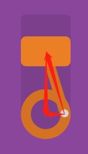

##  （十五）CSS动画

> **`1：基本概念`**

- **`过渡动画 - Transition`**
	- `初始状态` 过渡到 `结束状态` 所产生的动画

	- `只能定义初始和结束两个状态`

	- `最简单的CSS动画`

	- `被动触发`

	- `不能重复发生`

- **`关键帧动画 - Animation - @keyframes `**
	```css
	@keyframes 动画名称 {
	    时间点 {
			元素状态
		}
	    时间点 {
			元素状态
		}
	    时间点 {
			元素状态
		}
	    时间点 {
			元素状态
		}
	    …
	}
	```

	- `可以定义多个状态`

	- `更复杂的动画效果`

	- `可以主动触发`

	- `可以重复发生`

> **`2：浏览器支持`**
  - **完全支持该属性的第一个浏览器版本**

    

> **`3：基本语法`**

```css
.main {
    animation: animationname duration timing-function delay iteration-count direction fill-mode play-state;
}


@keyframes animationname {
    from { css-code }
    to { css-code }

    0% - 100% { css-code }
}
```

> **`4：animationname - 关键帧名称`**
```css
.main {
    animation-name: around;
    animation-duration: 5s;
    animation-iteration-count: infinite;
}

@keyframes around {
    from { css-code }
    to { css-code }

    0% - 100% { css-code }
}
```

> **`5：duration - 动画持续时间`**

- `单位 s / ms`

```css
.main {
    animation-name: around;
    animation-duration: 500ms;
    animation-iteration-count: infinite;
}

@keyframes around {
    from { css-code }
    to { css-code }

    0% - 100% { css-code }
}
```

> **`6：timing-function - 时间函数曲线`**

```css
.main {
    animation-name: around;
    animation-duration: 5s;
    animation-iteration-count: infinite;
    animation-timing-function: cubic-bezier(0.075, 0.82, 0.165, 1);
}
```

- `时间区间 两套CSS样式之间`

- `linear`

- `ease`

- `ease-in`

- `ease-out`

- `ease-in-out`

- `cubic-bezier(n, n, n, n)`

> **`7：delay - 动画开始延迟时间`**

- `单位 s / ms`

- `仅定义第一次开始延迟时间`

```css
.main {
    animation-name: around;
    animation-duration: 5s;
    animation-iteration-count: infinite;
    animation-timing-function: cubic-bezier(0.075, 0.82, 0.165, 1);
	animation-delay: 3s;
}
```

> **`8：iteration-count - 动画播放次数`**

```css
.main {
    animation-name: around;
    animation-duration: 5s;
    animation-iteration-count: infinite;
    animation-timing-function: cubic-bezier(0.075, 0.82, 0.165, 1);
    animation-delay: 3s;
}
```

- `n - 具体的播放次数`

- `infinite - 无限循环`

> **`9：direction - 动画播放方向`**

```css
.main {
    animation-name: around;
    animation-duration: 5s;
    animation-iteration-count: infinite;
    animation-timing-function: cubic-bezier(0.075, 0.82, 0.165, 1);
    animation-delay: 3s;
    animation-direction: alternate;
}
```

- `normal - 正常播放`

- `reverse - 反向播放`

- `alternate - 奇数次正向, 偶数次反向`

- `alternate-reverse - 偶数次正向, 奇数次反向`

> **`10：fill-mode - 动画不播放时应用到元素的样式`**
```css
.main {
    animation-name: around;
    animation-duration: 5s;
    animation-iteration-count: infinite;
    animation-timing-function: cubic-bezier(0.075, 0.82, 0.165, 1);
    animation-delay: 3s;
    animation-direction: alternate;
	animation-fill-mode: forwards;
}
```
- `none - 动画结束后恢复原有样式`

- `forwards - 动画结束后动画将应用该属性值`

- `backwards - 动画开始前应用第一帧的样式`

- `both`

> **`11：play-state - 控制动画运行或暂停`**

- `paused`

- `running`

> **`10：课后练习`**
- 关键帧动画动画的显著特点是
	```css
	A : 连续播放
	B : 可以定义动画的中间状态
	C : 只能被动触发
	D ：实现复杂动画
	```
- 实现一个鼠标悬浮触发@keyframes的例子
	```css
	.main {
		width: 100px;
		height: 100px
	}

	@keyframes change {
		from {
			transform: rotateZ(0deg)
		}
		to {
			transform: rotateZ(90deg)
		}
	}
	```
- 使用Animation实现其中一种轮播图

  

  


- 使用CSS动画实现下图效果

  

  - `要求`
  ```css
  圆环外圈宽度高度： 100px

  圆环径向举例：20px

  背景颜色：#8A469B

  圆环颜色：#EA7F26

  摇柄上下运动贝塞尔曲线：cubic-bezier(.5, 0, .5, 1)
  ```
  - `提示`
  ```css
  水平方向和垂直方向速度叠加
  
  先完成垂直运动动画
  ```
	
> **`12：总结`**

```
本节课介绍了CSS两种典型动画各自的特点, 重点介绍了CSS帧动画的六个常用属性, 最后结合练习题介绍了帧动画的常用场景
```