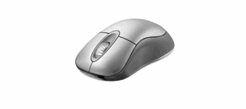
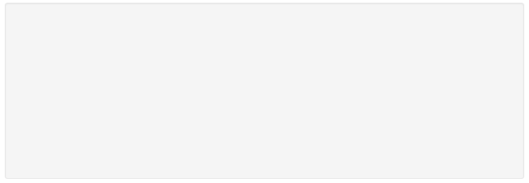

##  （十六）CSS常用动画库简介与JS动画

> **`1：Animate.css`**
  - `cool, fun, and cross-browser animations`

  - `抖动(shake)、闪烁(flash)、弹跳(bounce)、翻转(flip)、旋转(rotateIn/rotateOut)、淡入淡出(fadeIn/fadeOut)等多达 60 多种动画效果`

  - `演示地址 - ` [https://daneden.github.io/animate.css/](https://daneden.github.io/animate.css/)

  - `Github地址 - ` [https://github.com/daneden/animate.css](https://github.com/daneden/animate.css)

  - `很值得学习内部代码的CSS动画库`

> **`2：Animate.css使用`**
- `引入Animate.css`
  - `本地引入`

  - `CDN引入 - 内容分发网络, 快速找到最近的节点提供资源下载`
    - `<link rel="stylesheet" href="https://cdnjs.cloudflare.com/ajax/libs/animate.css/3.7.0/animate.min.css">`

- `使用`
```css
<div class="animated bounce infinite"></div>
```

- `动态添加样式`
```css
document.getElementById("main").classList.add('bounce')
```

- `动态移除样式`
```css
document.getElementById("main").classList.remove('bounce')
```

- `重写样式`
```css
#main {
    animate-duration: 2s;
    animate-delay: 1s;
    animate-iteration-count: 2;
}
```

- `npm按需引入`
```css
npm install animate.css
```
```css
animate-config.json 文件

{
  "scripts": {
    "gulp": "./node_modules/gulp/bin/gulp.js",
  },
}
```

> **`3：JS动画`**

- `JS动画 - 使用Javascript控制元素的样式`

- `链式动画`

  

- `复杂图像 + 色彩变幻`

  

> **`4: 控制元素样式`**

```css
function mouseOver() {
    document.getElementById('image').src ="./1.jpg"
}
function mouseOut() {
    document.getElementById('image').src ="./2.jpg"
}
```

> **`5: 返回顶部`**

  

  ```css
var interval;
var distance = document.body.scrollHeight / 1000;
var end = document.body.scrollHeight;
var current = document.body.scrollHeight - distance;

interval = setInterval(function() {
    window.scrollTo(0, current);
    current = current - distance;
    if(window.scrollY <= 0){
        clearInterval(interval);
    }
}, 10)
  ```

> **`6: SetInterval 与 RequestAnimationFrame`**

- `SetInterval (执行完一定记得clearInterval释放)`
  - `定时器 - 制定时间间隔执行函数`

  - `运行在JS主线程 - setInterval与setTimeout时间间隔不准确 - 卡顿丢帧`

  - `不释放始终运行 - 性能问题(浏览器窗口激活)`

- `RequestAnimationFrame`

- `高性能帧动画API`

  - `把每一帧中的所有DOM操作集中起来，在一次重绘或回流中就完成`

  - `重绘或回流的时间间隔紧紧跟随浏览器的刷新频率`

  - `隐藏或不可见的元素不会进行重绘或回流(浏览器窗口激活)`

  ```css
  var distance = document.body.scrollHeight / 100;
  var end = document.body.scrollHeight;
  var current = 0;

  function bottom() {
      window.scrollTo(0, current);
      current = current + distance;
      if(current <= end){
          requestAnimationFrame(bottom);
      } else {
          cancelAnimationFrame(bottom);
      }
  }

  requestAnimationFrame(bottom);
  ```

> **`7: CSS动画与JS动画`**
- `CSS动画`
  - `浏览器对动画进行优化`
    - `类requestAnimationFrame机制`

    - `硬件加速`

  - `代码相对简单`

  - `帧速表现不好的低版本浏览器, 可以自然降级`

  - `运行过程控制较弱`
    - `无法得知进度`

    - `无法绑定函数回调`

  - `代码冗长`

- `JS动画`

  - `控制能力强`

  - `动画效果丰富`

  - `兼容性问题小`

  - `主线程中运行 - 阻塞、丢帧`

  - `代码复杂度高`

- `根据实际需求决定采用哪种方案`

> **`8：课后练习`**

- `使用Animate.css动画库实现下图效果`

  

- `实现下图小球的自由落体效果`

  

  - `方式`
    - `纯JS动画结合requestAnimationFrame`

    - `JS动画结合贝塞尔曲线`

  - `要求`
    - `仅使用JS动画与CSS动画`

    - `不得使用第三方库`

    - `弹起时速度为反向速度的80%`

    - `下落加速度大小参照重力加速度`

    - `弹跳十次结束运动`

> **`9：总结`**

```
本节课介绍了CSS动画其中一个比较常用的动画库, 简要介绍了Animate.css的使用, 之后介绍了JS动画的使用方法, 对比了CSS动画与JS各自的特点
```