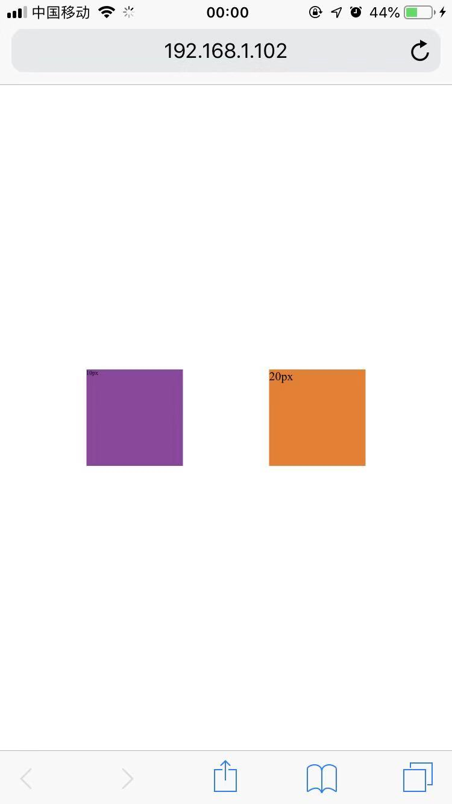
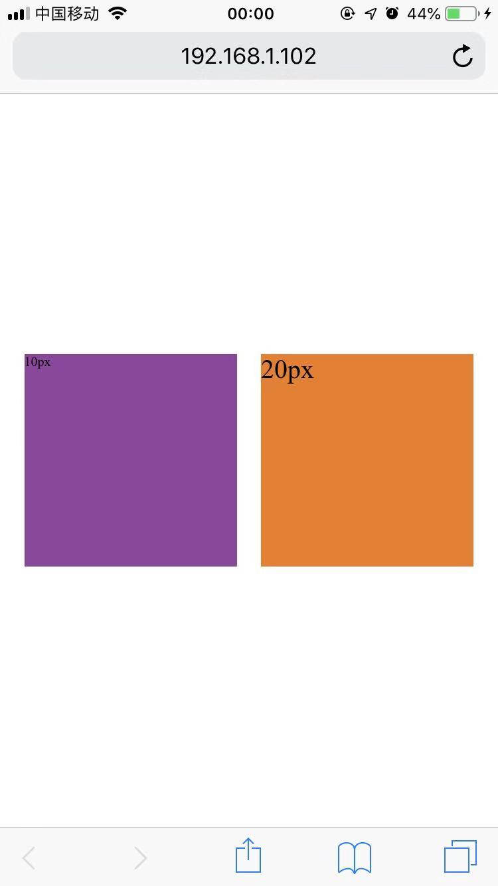
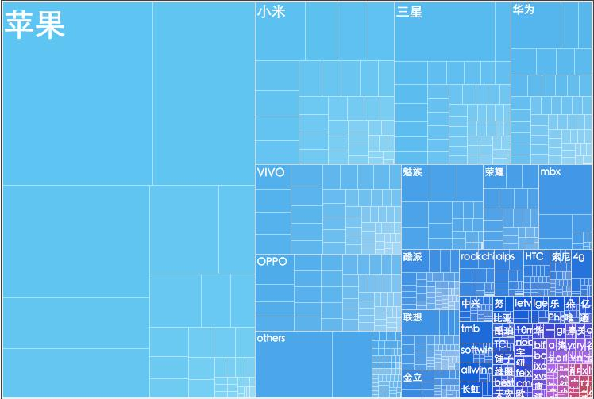
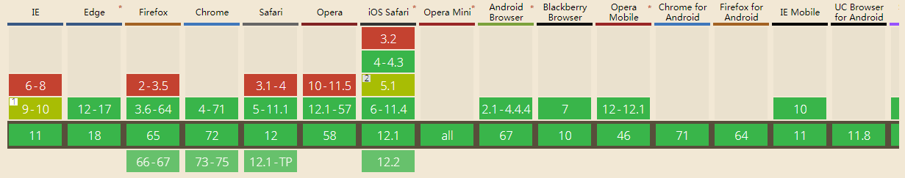
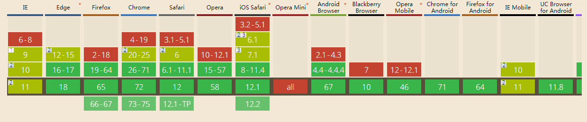

##  （十七）REM布局原理

> **`1：基本概念`**
- `em - 当前对象内文本的字体大小相对单位`

- `rem - 字体大小相对单位`

- `物理像素`

- `逻辑像素`

- `设备像素比 - dpr`

- `<meta> 标签`
    
    ```css
    <meta name="viewport" content="width=device-width, initial-scale=1.0, maximum-scale=1.0, user-scalable=0">
    ```

    - `layout viewport - 浏览器默认视口 - 可以显示PC界面`
        - `clientWidth`

        - `移动设备默认的viewport`

    - `visual viewport - 浏览器可视区域大小`
        - `innerWidth`

    - `ideal viewport - 理想viewport`
        - `iphone的ideal viewport宽度320px`

    - `initial-scale - layout viewport相对于ideal viewport缩放比例`

    - `取widthh和initial-scale中较大值`

    - `initial-scale - 0.5 (左) - 1 (右)`

    
    &nbsp;&nbsp;&nbsp;&nbsp;
    


> **`2：适配设备屏幕 (移动端)`**



- `最终目标 - 设计稿等比缩放在设备上`

- `动态处理Mate标签scale`

    - `像素比 - 1 - scale=1`
    - `像素比 - 2 - scale=2`
    - `像素比 - 3 - scale=3`

    - `获取设备的像素比`
    ```css
    var devicePixelRatio = window.devicePixelRatio;
    var scale = 1 / devicePixelRatio;

    var metaElement = document.createElement('meta');
    metaElement.setAttribute('name', 'viewport'); metaElement.setAttribute(
        'content',
        'initial-scale=' + scale + ',
         maximum-scale=' + scale + ',
         minimum-scale=' + scale + ',
         user-scalable=no'
    );

    document.documentElement.firstElementChild.appendChild(metaElement);
    ```

- `动态处理根节点font-size`

    ```css
    var rem = document.documentElement.clientWidth / 10
    document.documentElement.style.fontSize = rem + 'px'
    ```

> **`3：还原设计图 (移动端)`**
- `缩放`
    - `设计图尺寸640px * 750px`
        - `兼容大多数设备的折中方案`
        - `避免高清屏图片模糊`
        - `1px边框问题 - 根据像素比缩放`

    - `高清屏0.5缩放`

    - `普通屏不缩放`

- `font-size`
    - `将设计稿分成100份 - 预留 vw/vh 适配`

    - `1rem = 750px / 10 = 75px`

    - `等比例缩放`


> **`4：还原设计图 (PC端)`**

- `缩放 = 1`

- `font-size`
    - `设计图尺寸1920px * 1080px`

> **`5：动态更改font-size`**
```css
window.addEventListener('resize', resize)
```

> **`6：vw / vh 与rem`**
- `rem`
    - `动态设置跟font-size`
    - `用户无法设置更大字体`

    

- `vw / vh`
    - `自动缩放`
    - `不影响字体`
    - `兼容性差`

    

> **`7：课后练习`**

> **`8：总结`**

```
本节课从移动端viewport切入, 介绍了rem的基本概念, 之后从viewport与font-size两个方面介绍了移动端自适应方案并扩展到PC端，最后介绍了css新特征vw与vh方案
```