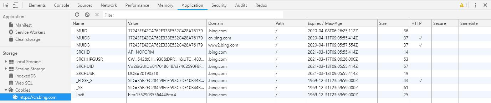

##  （二十一）Web存储技术(上)

> **`1：背景介绍`**
- `Cookie - 网站身份证`
	- `网站为了辨别用户身份、进行 session 跟踪而储存在用户本地终端上的数据`

	- `存储电脑硬盘上的一个txt类型的小文件`

	- `安全性问题 - 双刃剑`

	- `...`

- `Cookie局限`
	- `主流浏览器最大支持 4096 字节`

	- `主流浏览器限制每个网站的Cookie个数 - 20`

	- `Cookie默认会跟随所有Http请求发送 - 浪费网络资源`

	- `部分浏览器限制Cookie总数 - 300`

	- `...`

- `Web Storage应运而出`
	- `存储大量数据`

	- `支持复杂的本地数据库`

	- `SessionStorage`

	- `LocalStorage`

	- `WebSQL`

> **`2：Cookie`**

- `身份证 - 服务器可以针对不同用户, 做出不同的响应`

- `浏览器储存在用户的机器上的纯文本, 没有可执行代码`

- `浏览器默认携带当前访问网站的Cookie`

	

- `Cookie类型`
	- `会话Cookie - 退出浏览器即删除`

	- `持久Cookie`
		- `特定的过期时间(Expires)`
		- `有效期(Max-Age)`

- `Cookie域 - Domain`
	- `控制Cookie使用权限`

- `Cookie路径 - Path`
	```css
	www.baidu.com                id="123456" domain="www.baidu.com"
	www.baidu.com/user           id="123456" user="eric" domain="www.baidu.com" path="/user/"

	www.baidu.com/search         id="123456";
	www.baidu.com/user/search    id="123456" user="eric";
	```

- `Cookie - secure`
	- `只有https情况下使用`

- `Cookie - HttpOnly`
	- `不允许Javascript操作Cookie`

- `安全性`
  - `服务器无法分辨用户和攻击者(攻击者窃取网站Cookie)`

	- `跨站点脚本XSS`

	- `跨站请求伪造CSRF`

> **`3：SessionStorage`**
- `HTML5新增的会话存储对象`

- `临时保存同一窗口(标签页)的数据`

- `关闭窗口(标签页)删除数据`

> **`4：LocalStorage`**

> **`5：WebSQL`**

> **`7：课后练习`**

> **`8：总结`**

```
本节课讲解了Flex弹性盒模型的基本概念, 简要介绍了Flex弹性盒模型的发展历程，最后重点介绍了Flex container六个属性以及Flex item的六个属性
```