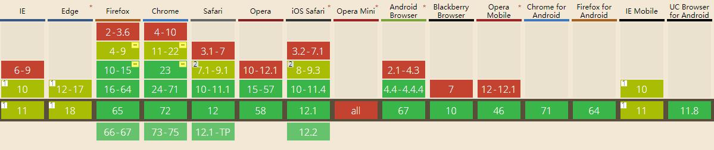

##  （二十二）IndexedDB

> **`1：背景技术`**
- `Storage不适合储存大量数据`

- `Storage不提供搜索功能`

- `Storage不能建立索引`

- `IndexedDB - 250MB 以上`

> **`2：基本概念`**
- `非关系型数据库 - NoSQL`

- `特点`

	- `键值对储存 - 允许所有类型 - 主键重复报错`

	- `异步操作 - 不阻塞浏览器线程`

	- `支持事务 - 一系列操作有一步失败, 数据库回滚到事务发生之前的状态`

	- `同源限制`

	- `支持二进制储存`

- `IDBDatabase - 数据库`

- `IDBObjectStore - 对象仓库`

- `IDBIndex - 索引`

- `IDBTransaction - 事务`

- `IDBRequest - 操作请求`

- `IDBCursor - 指针`

- `IDBKeyRange - 主键集合`

> **`3：浏览器兼容`**



> **`4：IDBDatabase`**
- `数据的容器`

- `每个不同源可以新建多个数据库`

- `版本`
	- `同一个时刻只能有一个版本存在`
	- `修改数据库结构只能通过升级数据库版本`

- `打开数据库`
	```css
	/* databaseName不存在则创建 */
	/* version为整数, 新建时为1 */

	let database;
	let userStore;
	const request = window.indexedDB.open(databaseName, version);

	/* 成功打开数据库 */
	request.onsuccess = event => {
        database = request.result;
	}

	/* 打开数据库失败 */
	request.onerror = error => {
        console.log(error);
	}

	/* 版本号大于当前数据库版本 */
	request.upgradeneeded = event => {
        database = event.target.result;
	}
	```

> **`5：IDBObjectStore`**
- `数据库表`

- `创建表 - 最好在upgradeneeded中执行`

- `指定主键`
	- `autoIncrement: true`
	- `keyPath: 'id'`

	```css
	const createStore = () => {
        if(!db.objectStoreNames.contains('user')) {
            userStore = database.createObjectStore('user', { keyPath: 'id' });
        }
	}
	```
- `指定索引`
	```css
	const createStore = () => {
        if(!database.objectStoreNames.contains('user')) {
	        userStore = database.createObjectStore('user', { keyPath: 'id' });
	        userStore.createIndex('name', 'name', { unique: true });
	    }
	}
	```

> **`6：IDBTransaction`**

- `数据增啥改查`

	- `complete`
	- `error`
	- `abort`

- `属性`

	- `IDBTransaction.db`
	- `IDBTransaction.mode`
		- `readonly`
		- `readwrite`
	- `IDBTransaction.objectStoreNames`
	- `IDBTransaction.error`

- `新增数据 - add`
	- `已创建主键 - 新增必须包含主键`
	- `已创建主键 - 主键不可重复`

	```css
	const add = () => {
	    /* 创建事务 */
	    /* 使用某个数据库 */
	    /* add新增 */
	    transactionRequest = database.transaction(['user'], 'readwrite')
	        .objectStore('user')
	        .add({ id: 100, name: 'Eric', age: 28, email: 'Ericlee00@163.com' });

	    /* 成功 */
	    transactionRequest.onsuccess = event => {
	        console.log('数据写入成功', event);
	    };

	    /* 失败 */
	    transactionRequest.onerror = error => {
	        console.log('数据写入失败', error);
	    }
	}
	```

- `读取数据 - get`

	```css
	const read = () => {
        /* 创建事务 */
        transaction = database.transaction(['user']);
        /* 选择数据库表 */
        table = transaction.objectStore('user');
        /* 读取数据 */
	    transactionRequest = table.get(2);

	    /* 成功 */
	    transactionRequest.onerror = event => {
            console.log('数据读取失败', event);
		};

	    /* 失败 */
        transactionRequest.onsuccess = event => {
            if (transactionRequest.result) {
                console.log('数据读取成功', transactionRequest.result);
            } else {
                console.log('未读取到数据');
            }
        };
	}
	```

- `更新数据 - put`
	- `更新不存在的数据会新建`

	```css
	const update = () => {
        transactionRequest = database.transaction(['user'], 'readwrite')
            .objectStore('user')
            .put({ id: count, name: 'David', age: 35, email: 'David@xiakedao.com' });

        transactionRequest.onsuccess = function (event) {
            console.log('更新数据成功', event);
        };

        transactionRequest.onerror = error => {
            console.log('更新数据失败', error);
        }
    }
	```

> **`7：IDBCursor`**
- `指针`

- `遍历数据`
	```css
	const readAll = () => {
        table = database.transaction('user').objectStore('user');

        table.openCursor().onsuccess = () => {
            let cursor = event.target.result;

            if (cursor) {
                console.log('数据遍历', cursor);
            cursor.continue();
            } else {
                console.log('数据遍历完成');
            }
        };
    }
	```
