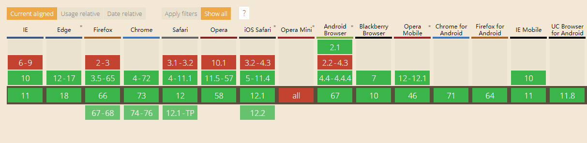
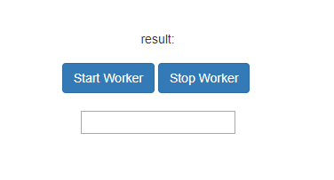

##  （二十四）初识WebWorker

> **`1：基本概念`**

- `JS单线程 - 同一时间只能做一件事`

- `JS宿主(浏览器 Node)支持多线程`

- `浏览器常驻线程`
	- `UI线程 - 回流和重绘 - 与Javascript线程互斥`
	- `JavaScript线程 - 单线程运行JavaScript`
	- `GUI线程 - 交互线程`
	- `...`
	- `Network线程`
	- `File线程`
	- `定时器线程`

- `基于事件驱动`

- `Event Loop`

	

- `异步 - 将耗时长的任务放置到Event Queue尾部`

- `WebWorker`
	- `JavaScript多线程模型 - 基于宿主`
	- `子线程`
	- `完全受主线程控制`
	- `不能操作DOM`

> **`2：浏览器兼容`**



> **`3：应用场景`**

- `处理影响浏览器UI线程的JavaScript运算`

> **`4：WebWorker特点`**
- `一旦新建会始终运行, 不会被主线程打断`

- `同源限制`

- `不能操作和访问DOM(window、document)`

- `不能使用包含交互的全局方法(alert、confirm) - 可以使用XMLHttpRequest、setTimeout、setInterval`

- `不能读取本地文件`

- `dedicated web worker(专用线程)`

- `shared web worker(共享线程)`

> **`5：基本用法`**

- `创建WebWorker - 资源只能来自网络`
	```css
	const webWorker = new Worker('main.js');
	```

	```css
	let result = 0;

	const fibonacci = (n) => {
        if (n <= 1) return 1;
        return fibonacci(n - 1) + fibonacci(n - 2);
	}

	result = fibonacci(10);

	console.log('result', result);
	```

- `向WebWorker发送消息(数据)`
	```css
	webWorker.postMessage({ number: 10 });
	```

- `WebWorker接收消息`
	```css
	this.addEventListener('message', event => {
        console.log('received main worker data', event);
	}, false);
	```

- `WebWorker发送消息(数据)`
	```css
	this.postMessage(returnValue);
	```

- `接收WebWorker消息`
	```css
	webWorker.addEventListener('message', event => {
        console.log('received webworker data', event.data);
    }, false);
	```

- `关闭WebWorker`
	```css
	webWorker.terminate();

	关闭 WebWorker
	```
	```css
	this.close();

	不再接收新的 Macrotask
	```

> **`6：WebWorker调用脚本`**
```css
importScripts('./one.js', './two.js');
```

> `7：WebWorker错误监听`
```css
webWorker.addEventListener('error', error => {
    console.error(error.filename, error.lineno, error.message);
});
```

> **`8：课后练习`**
- `浏览器UI线程和JavaScript为什么是互斥的`

- `使用WebWorker实现下图效果`

	

	- `要求`
	```css
	运算在WebWorker中执行

	数字递增即可

	输入框中可以正常输入
	```

- `不使用WebWorker实现下图效果, 比较输入框输入是界面效果`

	

> **`9：总结`**
```css
本节课从JavaScript单线程模型入手, 介绍了WebWorker的产生背景, 介绍了WebWorker从创建到销毁的整个生命周期
```