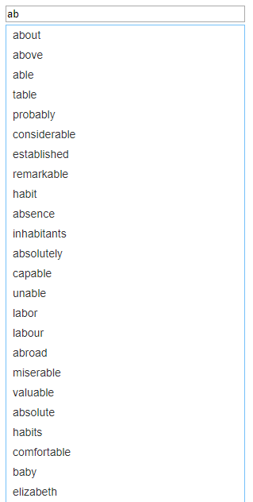

##  （二十五）WebWorker进阶

> **`1：WebWorker与主线程通信`**

- `通信内容`
	- `字符串`
	- `对象`
	- `二进制`
	- `...`
	- `任何Javascript可以表示存储的内容`

- `通信是拷贝关系`

- `二进制数据转移 - 转移之后当前线程无法操作`
	```css
	webWorker.postMessage(arrayBuffer, [arrayBuffer]);
	```


> **`2：执行同页面的WebWorker`**
- `未知的Script类型 - 代码不会执行`
```css
<script id="samePageWorker" type="unknow">
    addEventListener('message', () => {
        postMessage('send message!');
    }, false);
</script>
```
- `二进制读取并开启新的WebWorker`
```css
const blob = new Blob([document.getElementById('samePageWorker').text]);
const url = URL.createObjectURL(blob);
/* 获取保存在内存中的文件地址 */
const webWorker = new Worker(url);

webWorker.postMessage(123);
```

> **`3：WebWorker嵌套`**
```css
const webWorker = new Worker('./main.js');

window.webWorker = webWorker;

webWorker.postMessage('Hello');
```

```css
this.addEventListener('message', event => {
    console.log('received index.html data', event.data);
}, false);

const webWorker = new Worker('./index.js');

webWorker.postMessage('Word');
```

```css
this.addEventListener('message', event => {
    console.log('received main data', event.data);
}, false);
```

> **`4：Shared WebWorker - 跨页面通信`**

- `不能使用console`

```css
const shareWorker = new SharedWorker('./main.js');

window.shareWorker = shareWorker;

shareWorker.port.start();

shareWorker.port.postMessage(1);

shareWorker.port.onmessage = event => {
    console.log(event.data);
}
```

```css
const shareWorker = new SharedWorker('./main.js');

shareWorker.port.postMessage(1);

shareWorker.port.onmessage = event => {
	console.log(event.data);
};

shareWorker.port.start();
```

```css
let temp = 1;

this.onconnect = event => {
    const port = event.ports[0];

    port.start();

    port.onmessage = e => {
        temp = temp + e.data;
        port.postMessage(temp);
    }
}
```

> **`5：课后练习`**
- 使用WebWorker实现单词输入匹配功能(包含10000个英语单词)

	

> **`6：总结`**
```css
本节课介绍WebWorker特殊应用场景, 扩展了WebWorker的能力, 为跨页面通信提供了另外一种思路
```