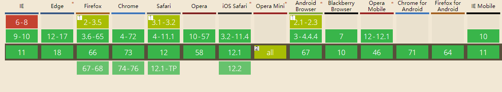
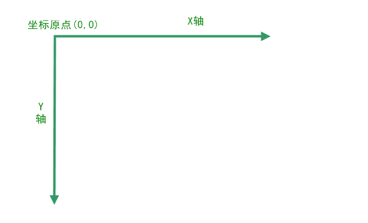
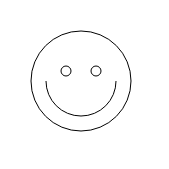
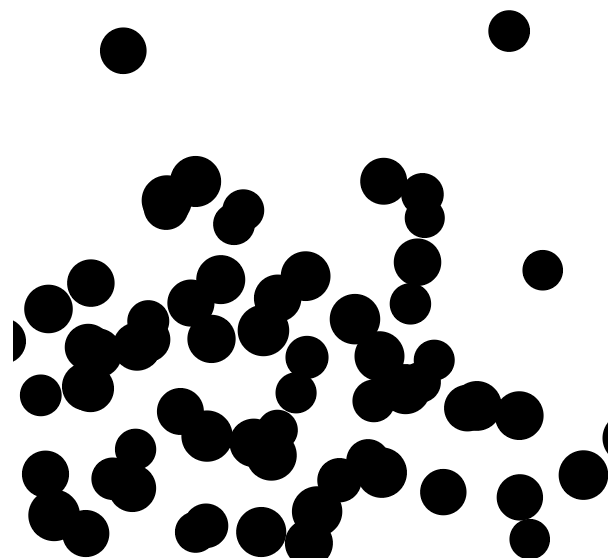

##  （二十七）Canvas简介与基础用法

> **`1：基本概念`**

- `<canvas> - HTML5新特征`

- `HTML代码配合高度和宽度属性而定义出的可绘制区域`

- `使用脚本(JavaScript)绘制图像的HTML元素`

- `制作照片 - 制作动画 - 实时视频处理`

- `HTML不存在一套二维绘图API - 苹果公司提出Canvas前身`

> **`2：浏览器兼容`**



> **`3：<canvas>元素`**

- `width - 宽度 - 默认300px`

- `height - 高度 - 默认150px`

```css
<canvas width="300px" height="150px" id="canvas">
    您的浏览器不支持Canvas
     
</canvas>
```

> **`4：坐标系统`**



> **`5：Rending Context(渲染上下文 - 画笔)`**

```css
const canvas = document.getElementById('canvas');

/* 获得 2d 上下文对象 */
const ctx = canvas.getContext('2d');
```

> **`6：原生绘制API`**
- `fillRect(x, y, width, height) - 填充矩形`

- `strokeRect(x, y, width, height) - 矩形边框`

- `clearRect(x, y, widh, height) - 清空`

```css
ctx.fillRect(0, 0, 50, 50);
ctx.strokeRect(50, 50, 100, 100);
ctx.clearRect(10, 10, 30, 30);
```

> **`7：绘制线段 - Path`**
```css
ctx.beginPath();

ctx.moveTo(0, 0);

ctx.lineTo(300, 150);

ctx.closePath();

ctx.stroke();
```

> **`8：绘制三角形 - Path`**
```css
ctx.beginPath();

ctx.moveTo(0, 0);

ctx.lineTo(300, 0);

ctx.lineTo(150, 150);

ctx.closePath();

ctx.fill();
```

> **`9：绘制圆 - Path`**
- `arc(x, y, radius, startAngle, endAngle, anticlockwise)`
    ```css
    ctx.beginPath();

    ctx.moveTo(0, 0);

    ctx.arc(150, 75, 50, 0, Math.PI / 2, false);

    ctx.stroke();
    ```

- `arcTo(x1, y1, x2, y2, radius)`

    ```css
    ctx.beginPath();

    ctx.moveTo(0, 0);

    ctx.arcTo(100, 100, 400, 100, 400);

    ctx.stroke();
    ```

> **`10：贝塞尔曲线 - Path`**

- `cubic-bezier(n1, n2, n3, n4)`
    - `P0 (0, 0)`
    - `P1 (1, 1)`
    - `P2 (n1, n2)`
    - `P3 (n3, n4)`

```css
ctx.beginPath();

ctx.bezierCurveTo(0, 123, 100, -9, 100, 100);

ctx.stroke();

```

> **`11：课后练习`**
- `使用Canvas绘制下图笑脸`

  

- `使用Canvas随机生成气泡`

  

  ```css
  大小随机

  位置随机
  ```

> **`12：总结`**
```css
本节课介绍了Canvas元素基本概念和坐标系统, 从线段、三角形、圆和贝塞尔曲线四个示例介绍了Canvas元素的基本绘制方法
```