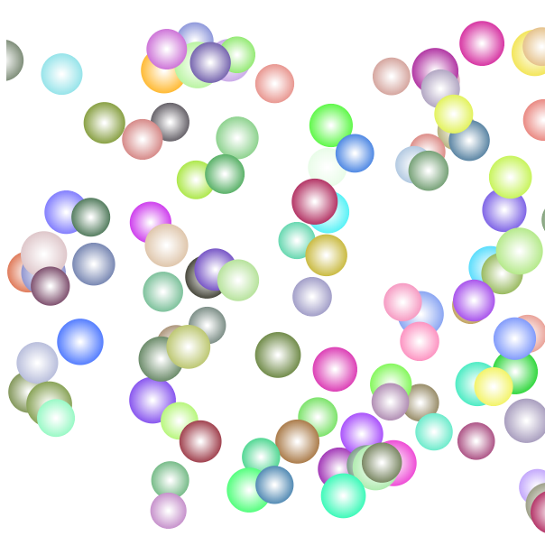

##  （二十八）丰富Canvas应用

> **`1：添加样式`**
- `fillStyle - 填充`
    - `颜色 - CSS 颜色值`
    ```css
    ctx.fillStyle = '#329FD9';
    ctx.fillRect(0, 0, 400, 100);
    ```
    - `渐变对象 - Gradient`
        - `createLinearGradient`
        ```css
        const linearGradient = ctx.createLinearGradient(0, 300, 400, 0);
        linearGradient.addColorStop(0, "#8A469B");
        linearGradient.addColorStop(0.5, "#FFFFFF");
        linearGradient.addColorStop(1, "#EA7F26");
        ctx.fillStyle = linearGradient;

        ctx.fillRect(0, 100, 400, 100);
        ```
        - `createRadialGradient`

            
        ```css
        /* 径向渐变 - 同心圆 */
        const radialGradient1 = ctx.createRadialGradient(200, 250, 10, 200, 250, 60);
        radialGradient1.addColorStop(0, "#8A469B");
        radialGradient1.addColorStop(1, "#EA7F26");
        ctx.fillStyle = radialGradient1;

        ctx.fillRect(0, 200, 400, 100);


        /* 径向渐变 - 非同心圆 */
        const radialGradient2 = ctx.createRadialGradient(60, 350, 10, 350, 350, 60);
        radialGradient2.addColorStop(0, "#8A469B");
        radialGradient2.addColorStop(1, "#EA7F26");
        ctx.fillStyle = radialGradient2;

        ctx.fillRect(0, 300, 400, 100);
        ```
    - `图案(视频)对象 - Pattern`

        - `ctx.createPattern(image, "repeat | repeat-x | repeat-y | no-repeat");`
        ```css
        const img = new Image();
        img.src = "./backup.png";
        img.onload = () => {
            const pattern = ctx.createPattern(img, 'repeat');
            ctx.fillStyle = pattern;

            ctx.fillRect(0, 400, 400, 100);
        }
        ```
    - `设置之后成为默认属性`

- `strokeStyle - 轮廓`
    - `颜色`
    - `渐变对象`
    - `图案(视频)对象`
    - `设置之后成为默认属性`

- `transparency - 透明度`
    ```css
    ctx.globalAlpha = 0.1;
    ```

- `line style - 线条样式`
    - `lineWidth - 线条宽度`
        ```css
        ctx.beginPath();
        ctx.lineWidth = 10;
        ctx.moveTo(10, 10);
        ctx.lineTo(50, 50);
        ctx.closePath();
        ctx.stroke();
        ```
    - `lineCap - 线条端样式`
        ```css
        ctx.beginPath();
        ctx.moveTo(20, 150);
        ctx.lineTo(20, 250);
        ctx.lineWidth = 20;
        ctx.lineCap = 'round';
        ctx.stroke();
        ```
        - `butt - 平直的边缘 - 默认`
        - `round - 圆形线帽 - 宽度一半`
        - `square - 正方形线帽 - 宽度一半`
    - `lineJoin - 线条连接处端样式 - 同一path`
        - `miter - 尖角 - 默认`
        - `bevel - 斜角`
        - `round - 圆角`
    - `miterLimit - 斜接长度(不做介绍)`
    - `setLineDash - [实线长度, 间隙长度] - 虚线样式`
    - `lineDashOffset - 起始偏移量`
        ```css
        ctx.lineWidth = 1;
        ctx.setLineDash([45, 5]);
        ctx.lineDashOffset = -5;
        ctx.strokeRect(10, 450, 500, 100);
        ```

> **`2：绘制文本`**
- `font`
    - `font-style`
    - `font-variant`
    - `font-weight`
    - `font-size`
    - `font-family`
    - `...`
- `textAlign`
    - `start - 默认`
    - `end`
    - `left`
    - `right`
    - `center`
- `textBaseline`
    - `top`
    - `hanging`
    - `middle`
    - `alphabetic - 默认`
    - `ideographic`
    - `bottom`
- `direction`
    - `ltr`
    - `rtl`
    - `inherit - 默认`
- `fillText`
    - `fillText(text, x, y [, maxWidth])`
- `strokeText`
    - `strokeText(text, x, y [, maxWidth])`

> **`3：绘制图片`**
- `基本用法`
    ```css
    const img = new Image();
    img.src = "./backup.png";
    img.onload = () => {
        const pattern = ctx.createPattern(img, 'repeat');
        ctx.fillStyle = pattern;

        ctx.fillRect(0, 400, 400, 100);
    }
    ```
- `绘制img元素图片`
    ```css
    const img = document.getElementById('image');
    ```

- `图片缩放`
    ```css
    const img2 = new Image();
    img2.src = "./backup.png";
    img2.onload = () => {
        const pattern = ctx.createPattern(img2, 'repeat');
        ctx.fillStyle = pattern;

        ctx.drawImage(img2, 0, 200, 100, 100)
    }
    ```
- `图片切片`
    ```css
    const img3 = new Image();
    img3.src = "./backup.jpg";
    img3.onload = () => {
        const pattern = ctx.createPattern(img3, 'repeat');
        ctx.fillStyle = pattern;

        ctx.drawImage(img3, 0, 0, 640, 480);
        ctx.drawImage(img3, 320, 240, 640, 480, 0, 0, 640, 480);
    }
    ```

> **`4：状态保存`**
- `save - 状态存储在栈中`

- `restore - 栈中弹出恢复状态`

- `toDataURL(type, encoderOptions) - 保存为图片`
    - `type - 默认image/png`
    - `encoderOptions图片质量 - image/jpeg/webp - 0 - 1`


> **`5：课后练习`**

- `了解RGB、RGBA和Opacity的关系与区别`

- `使用Canvas绘制下图形状`

  

  - `宽度300px`
  - `高度150px`
  - `40% black - 40% green - 20% yellow`

- `使用Canvas绘制下图形状`

  

  - `宽度600px`
  - `高度600px`
  - `Math.floor(255 - 25.5 * i)`

- `将第27节气泡添加径向渐变(颜色不做限制)`

  

> **`6：总结`**
```css
本节课介绍了Canvas填充、文本以及图片等多媒体样式应用, 结合状态保存与恢复介绍了Canvas如何绘制多彩的内容
```