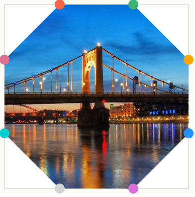
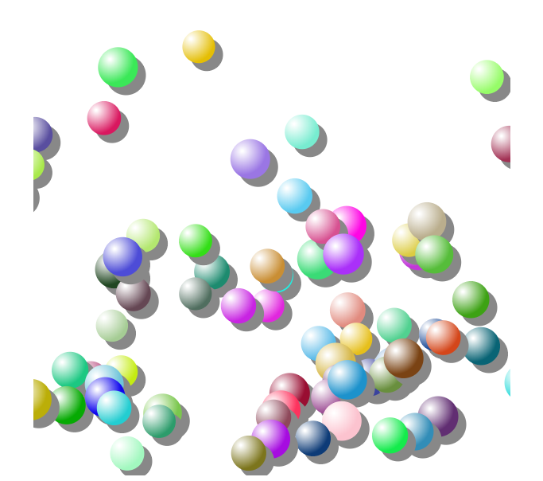

##  （二十九）Canvas变换

> **`1：Translate - 平移`**
- `translate(x, y)`
    - `x - 左右偏移量`
    - `y - 上下偏移量`

> **`2：Rotate - 旋转`**
- `rotate(angle) - 顺时针`

> **`3：Scale - 缩放`**
- `scale(x, y) - (x,y > 0)`

- `本质 - 像素比`

> **`4：Transform - 矩阵变换`**
- `transform(a, b, c, d, e, f)`
    - `水平缩放`
    - `水平倾斜`
    - `垂直倾斜`
    - `垂直缩放`
    - `水平移动`
    - `垂直移动`

- `对应矩阵`
    ```
        a   c   e 

        b   d   f

        0   0   1
    ```
    - `x' = a*x + c*y + 1*e`

    - `y' = b*x + d*y + 1*f`

    - `实现Translate`
        - `transform(1, 0, 0, 1, 100, 100)`
        - `translate(100, 100);`
    - `实现Scale`
        - `transform(0.5, 0, 0, 0.5, 0, 0)`
        - `scale(0.5, 0.5)`
    - `实现Rotate`
        - `transform(cosθ, sinθ, -sinθ, cosθ, 0, 0)`
        - `rotate(θ)`

> **`5：绘制阴影`**
- `shadowOffsetX - 阴影横向位移量`
- `shadowOffsetY - 阴影纵向位移量`
- `shadowColor - 阴影颜色`
- `shadowBlur - 阴影模糊范围`
```css
/* Shadow */
ctx.shadowOffsetX = 5;
ctx.shadowOffsetY = 5;
ctx.shadowColor = '#595959';
ctx.shadowBlur = 2;

/* Text */
ctx.font = "100px sans-serif";
ctx.fillText("侠课岛", 10, 400);
```

> **`6：画布合成`**
- `globalCompositeOperation - 混合属性`
    - `source-over - 目标图像上显示源图像 - 默认属性`

    - `source-atop - 源图像位于目标图像之外部分不可见`

    - `source-in - 显示目标图像之内的源图像部分, 目标图像透明`
    - `source-out - 显示目标图像之外的源图像部分, 目标图像透明`
    - `destination-over - 源图像上显示目标图像`
    - `destination-atop - 源图像顶部显示目标图像。目标图像位于源图像之外的部分不可见`
    - `destination-in - 源图像中显示目标图像。只显示源图像之内的目标图像部分, 源图像透明`
    - `destination-out - 源图像之外显示目标图像。只显示源图像之外的目标图像部分, 源图像是透明的`
    - `darken - 保证重叠部分最暗(16进制数值最大)的像素`
    - `lighter - 保证重叠部分最亮(16进制数值最小)的像素`
    - `copy - 只保留目标图像`
    - `xor - 源图像与目标图像重叠部分透明`

> **`7：路径裁剪`**
- `clip - 只显示裁剪路径内的区域`
```css
const polygon = (poly, context) => {
    context.beginPath();
    context.moveTo(poly[0], poly[1]);
    for (var i = 2; i <= poly.length - 2; i += 2) {
        context.lineTo(poly[i], poly[i + 1]);
    }
    context.closePath();
    context.stroke();
}

const canvas = document.getElementById('canvas');

/* 获得 2d 上下文对象 */
const ctx = canvas.getContext('2d');

const pointList = [300, 0, 366, 210, 588, 210, 408, 342, 474, 546, 300, 420, 126, 546, 192, 342, 12, 210, 234, 210];
polygon(pointList, ctx);
ctx.clip();

const img = new Image();
img.src = "./logo.png";
img.onload = () => {
    const pattern = ctx.createPattern(img, 'repeat');
    ctx.fillStyle = pattern;

    ctx.drawImage(img, 0, 0, 610, 610);
}
```
> **`8：课后练习`**
- `使用Canvas Cpip绘制下图八边形`

  

- `为气泡添加阴影效果并改变径向渐变中心`

  

> **`9：总结`**
```css
本节课介绍了Canvas变换相关内容, 从Tramsform、Shadow和Clip三个方面拓展了Canvas的绘图能力
```