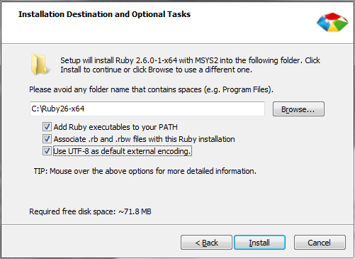
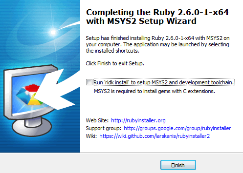

## （二）Sass初体验

> **1：环境布置**
- **安装Ruby**
  ```
  http://rubyinstaller.org/

  安装过程比较慢
  ```
  
  
- **更改Sass默认编码（可选）**
  ```
  到Ruby22\lib\ruby\gems\x.x.x\gems\sass-x.x.xx\lib\sass目录下

  Encoding.default_external = Encoding.find('utf-8')
  ```

- **安装Sass**

  ```
  更换淘宝源

  gem sources --add https://gems.ruby-china.com/ --remove https://rubygems.org/

  查看源
  gem sources -l

  安装sass
  gem install sass

  查看版本
  sass -v
  ```


> **2：sass和 SCSS**

- **SCSS是sass的一个升级版本，完全兼容sass**

- **SCSS是靠缩进表示嵌套关系，SCSS是花括号**

- **具体语法上面的差异**
  ```css
  $width: 100%;
  $height: 100px;
  $color: red;

  .container{
    width: $width;
    height: $height;
    background-color: $color;
    margin-bottom: 5px;
  }

  .container2{
    width: $width;
    height: $height;
    background-color: $color;
    margin-bottom: 5px;
  }

  .container3{
    width: $width;
    height: $height;
    background-color: $color;
    margin-bottom: 5px;
  }
  ```
  ```css
  !primary-color= hotpink

  =border-radius(!radius)
      -webkit-border-radius= !radius
      -moz-border-radius= !radius
      border-radius= !radius

  .my-element
      color= !primary-color
      width= 100%
      overflow= hidden

  .my-other-element
      +border-radius(5px)
  ```

- **. . .**

> **3：编译.scss文件**

```css
sass main.scss main.css
```
- **编译风格**
  ```css
  sass --style compressed main.sass main.css
  ```
  - **nested**  嵌套缩进的css代码
  - **expanded**  没有缩进
  - **compact**  简洁格式
  - **compressed**  压缩

- **文件侦听**
  ```css
    监听文件
  　sass --watch main.scss:main.css

  　监听文件夹
  　sass --watch xxxx/sass:xxxxx/xxxxx
  ```

> **4：Sass基本语法**

- **Sass嵌套**

    在 less 中父子元素嵌套：
    ```css
    .container {
        padding: 0;

        .header {
          background-color: red;
      }
    }
    ```
    Sass 写法
    ```css
    .container {
        padding: 0;

        .header {
            background-color: red;
        }
    }
    ```
    伪类的写法，在 less 中写法如下：
    ```css
    #header :after {
      content: " ";
      display: block;
      font-size: 0;
      height: 0;
      clear: both;
      visibility: hidden;
    }
    ```
    sass
    ```css
    #header {
      &:after {
        content: " ";
        display: block;
        font-size: 0;
        height: 0;
        clear: both;
        visibility: hidden;
      }
    }
    ```
    属性嵌套
    ```
    p {
        border: {
            color: red;
        }
    }
    ```

- **Sass变量**

  将三个 div 的背景颜色改成蓝色（blue）
  ```css
  $width: 100%;
  $height: 100px;
  $color: blue;

  $direction: left;
  .border {
    border-#{$direction}: solid 5px;
  }
  ```

    - sass 也是用 js 的写法来写 css
    - 使用 $ 符号定义变量
    - `$变量名` 看成是一个字符串

- **Sass函数**

  ```css
  @function double($x, $y, $z) {
    @return $x * $y * $z;;
  }
  #header{
    width: double(5, 5, 5px);
  }
  ```

  - Sass 内置函数
    - unquote 去引号
      - unquote('htts://www.baidu.com/images/1.png')
    - percentage 百分比
      - percentage(.5)
    - index 计算位置
      ```css
      .header {
        width: index(1px solid red, 1px);
      }
      ```
    - mix 混合颜色
      ```css
        mix (color, color, ratio);
      ```
    - lightness 获取亮度值
    - . . .
  
- **Sass注释**
  ```css
  // 普通注释
  // 只在源文件出现

  /*
  *　注释
  *  compressed的style的css中没有
  */

  /*！
  *　重要注释
  *  任何style的css文件中都会有
  */
  ```

- **Sass计算属性**
```css
body {
　　margin: (14px/2);
　　top: 50px + 100px;
　　right: $var * 10%;
}
```

- **Sass继承**
  - **extend**
  ```css
  .header {
    border: 1px solid #ddd;
  }
  .body {
    @extend .header;
  }
  ```
  - **mixin**
  ```css
  @mixin common {
    background-color: red;
  }
  .header{
    font-size: 16px;
    @include common;
  }
  ```
  类函数(向JS更进一步)
  ```css
  @mixin default($x, $y, $z: 12px){
    margin-left: $x;
    margin-right: $y;
    margin-top: $z;
  }
  .header {
    @include default(5px, 5px);
  }
  ```

- **Sass引入**
  - one.scss
  ```css
  .header {
    width: 100px;
    height: 200px;
  }
  ```
  - two.scss
  ```css
  @import "one.scss";
  ```

- **进阶属性**

  - **@**
  ```css
  .header {
    @if 10 == 10 { color: red; }
    @if 10 < 20 { color: red; }
  }
  ```

  - **else** 颜色值比较以突出文字
  ```css
  .header {
    @if 10 == 11 { color: red; }
    @else  { color: green; }
  }
  ```

  - **循环**
    - for
    ```css
    @for $index from 1 to 100 {
      .background-#{$index} {
          background-image: url("/image/#{$index}.jpg");
      }
    }
    ```
    - while
    - each
    ```css
    @each $item in red, green, yellow {
      .#{$item} {
        color: $item;
      }
    }
    ```

> **3：Sass与Less**
  - 优势
    - 功能上比更强
    - SCSS比较接近 CSS 语法
    - 生态环境完善

  - 劣势
    - 不能在浏览器中运行

> **5：课后练习**

  - body的color是
    ```css
    .header {
      border: 1px solid #ddd;
    }
    body {
      @extend .header;
      color: green;
      color: orange;
    }
    .header {
      color: red;
      color: yellow;
    }
    ```
    ```css
    A:  green

    B:  orange

    C: red

    D: yellow
    ```
  - class_one和class_two哪个在宽度上更宽
    ```css
    .format {
      width: percentage(0.5);
    }

    .class_one {
      .format
    }

    .class_two {
      .format()
    }
    ```
    ```
    A: class_one
    B: class_two
    C: 不知道
    D: 相同
    ```

  - 书写一个mixin，自动生成浏览器前缀

  - 用while循环实现讲义中的背景scss循环

> **5：总结**
```
本节课讲解了Less的基本使用，从嵌套、混合、变量、函数和引入五个方面介绍了Less的基础用法，并和Sass进行了概念层次的比较，分析Less的优劣势
```