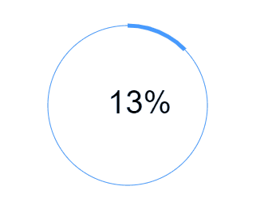
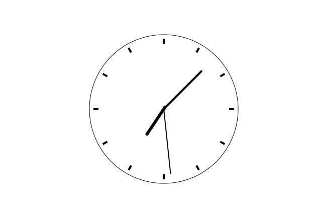

##  （三十）Canvas动画

> **`1：Canvas动画原理`**
- `快速切换的静态画面`

- `Frames Per Second`

- `人眼 - 24FPS`

- `游戏(屏幕) - 60FPS`

> **`2：基本步骤`**
- `绘制 - 清空 - 绘制 - 清空 - 绘制 ...`

> **`3：控制函数`**

- `setInterval`

- `setTimeout`

- `requestAnimationFrame`

> **`4：线性运动`**
```css
ctx.clearRect(0, 0, 600, 600);

ctx.beginPath();
ctx.moveTo(distance, 300);
ctx.arc(distance, 300, 50, 0, 2 * Math.PI, false);
ctx.fill();

distance = distance + speed;
```

> **`5：变速运动`**
```css
ctx.clearRect(0, 0, 600, 600);

ctx.beginPath();
ctx.moveTo(distance, 300);
ctx.arc(distance, 300, 50, 0, 2 * Math.PI, false);
ctx.fill();

distance = 9.8 * (Math.pow(count, 2)) / 200;
```

> **`6：函数运动 - 正弦`**
```css
axis = 300 + Math.sin(angle) * range;
```

> **`7：环形运动`**
```css
const draw = (axisX) => {
/* 清空画布(或部分清空) */
    ctx.clearRect(0, 0, 600, 600);
    radialGradient = ctx.createRadialGradient(x, y, 10, x, y, 50);
    radialGradient.addColorStop(0, "#FFFFFF");
    radialGradient.addColorStop(1, "#EA7F26");
    ctx.fillStyle = radialGradient;

    ctx.beginPath();
    ctx.moveTo(x, y);

    ctx.arc(x, y, 50, 0, 2 * Math.PI, false);

    ctx.fill();

    x = x + Math.cos(angle) * scope;
    y = y + Math.sin(angle) * scope;
    angle = angle + .1;

    requestAnimationFrame(draw);
    ctx.closePath();


    ctx.beginPath();
    ctx.arc(300, 300, 200, 0, 2 * Math.PI, false);
    ctx.stroke();
}

requestAnimationFrame(draw);
```
> **`8：课后练习`**
- `使用Canvas绘制下图环形进度条`

  

- `使用Canvas实现下图始终效果`

  

- `为前面的Canvas气泡添加运动效果`

  

  - `气泡向上做正弦运动`

> **`9：总结`**
```css
本节课介绍了Canvas动画效果的基本原理, 从线性、变速、函数及环形运动介绍了Canvas常用的运动函数
```