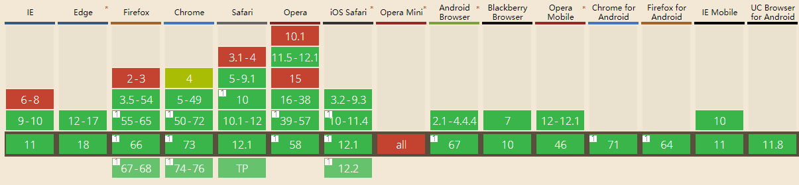

##  （三十一）HTML地理坐标

> **`1：定位基准`**
- `IP`
    - `ISP机房位置(登记位置) - 小区大楼级别 - 十几米`

- `GPS`
    - `卫星定位 - 精确 - 需要硬件支持 - 军方1米`

- `WIFI`
    - `Mac地址 - 比较精确 - 1米`

- `GSM或CDMA`
    - `设备基站 - 精度高 - 手机及通信设备 - 10米`

- `用户指定`

> **`2：获取流程`**
- `打开Web应用`

- `向浏览器请求地理位置, 弹出询问窗口`

- `浏览器从设备或受信任服务器获取位置信息并返回`

> **`3：浏览器兼容`**
- `使用前检测浏览器是否支持`



> **`4：获取用户当前位置(科学上网)`**
- `getCurrentPosition(onSuccess, onError, options)`

    - `options`
        - `enableHighAccuracy - 高精度标识`
        - `timeout - 超时时间 - 默认0(无穷大)`
        - `maximumAge - 缓存时间`

```javascript
const getLocation = () => {
    const options = {
        enableHighAccuracy: false, 
        maximumAge: 1000
    }
    if(navigator.geolocation) {
        //浏览器支持geolocation
        navigator.geolocation.getCurrentPosition(onSuccess,onError,options);
    } else {
        //浏览器不支持geolocation
        alert('当前浏览器不支持getLocation');
    }
}

//成功回调
function onSuccess(position) {
    const longitude = position.coords.longitude;
    //纬度
    const latitude = position.coords.latitude;
    console.log('position', { longitude, latitude });
}

//失败回调
function onError(error) {
    switch(error.code){
        case 1:
            alert("位置服务被拒绝");
        break;
        case 2:
            alert("暂时获取不到位置信息");
        break;
        case 3:
            alert("获取信息超时");
        break;
        case 4:
            alert("未知错误");
        break;
    }
}
```

> **`5：持续获取用户当前位置(科学上网)`**
- `watchCurrentPosition(onSuccess, onError, options)`

```javascript
let watchId = undefined;

const getLocation = () => {
    const options = {
        enableHighAccuracy: false, 
        maximumAge: 1000
    }
    if(navigator.geolocation) {
        //浏览器支持geolocation
        watchId = navigator.geolocation.watchPosition(showPosition);
    } else {
        //浏览器不支持geolocation
        alert('当前浏览器不支持getLocation');
    }
}

function showPosition(position) {
    const longitude = position.coords.longitude;
    const latitude = position.coords.latitude;

    console.log('position', { longitude, latitude });
}

const cancel = () => {
    if(watchId) navigator.geolocation.clearWatch(watchId);
}
```

> **`6：coords`**
- `coords.latitude - 十进制数的纬度`
- `coords.longitude - 十进制数的经度`
- `coords.accuracy - 位置精度`
- `coords.altitude - 海拔，海平面以上以米计`
- `coords.altitudeAccuracy - 位置的海拔精度`
- `coords.heading - 方向，从正北开始以度计`
- `coords.speed - 速度，以米/每秒计`
- `timestamp - 响应的日期/时间`

> **`7：调用百度地图显示实时位置`**
```css
<script type="text/javascript" src="http://api.map.baidu.com/api?v=2.0&ak=百度地图key"></script>

/* 创建Map实例 */
const map = new BMap.Map("map");
/* 初始化地图,设置中心点坐标和地图级别 */
map.centerAndZoom(new BMap.Point(116.404, 39.915), 11);
/* 开启鼠标滚轮缩放 */
map.enableScrollWheelZoom(true);
```
> **`8：Google地图(国内无法使用)`**

> **`9：课后练习`**
- `使用手机浏览器获取当前地理位置 - 使用express简易服务器`

> **`10：总结`**
```css
本节课介绍了浏览器地理坐标的获取基准, 结合具体百度地图展示了地理坐标从获取到展示的过程
```