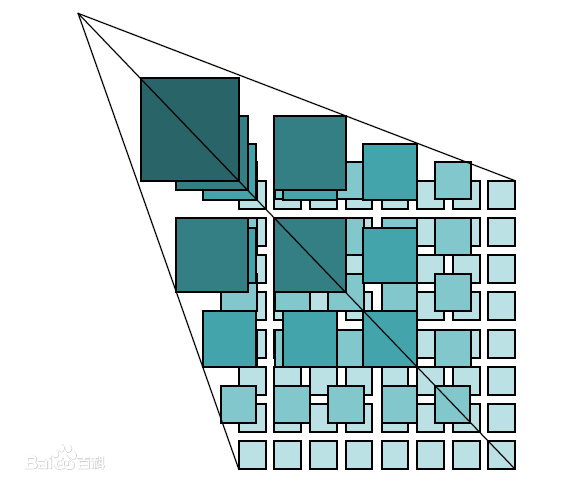
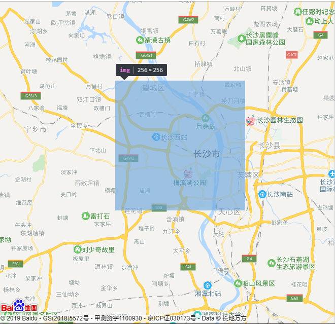
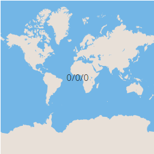
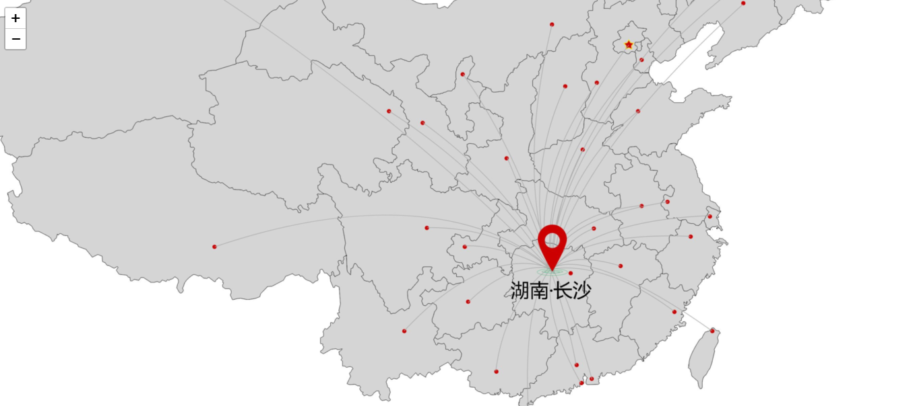
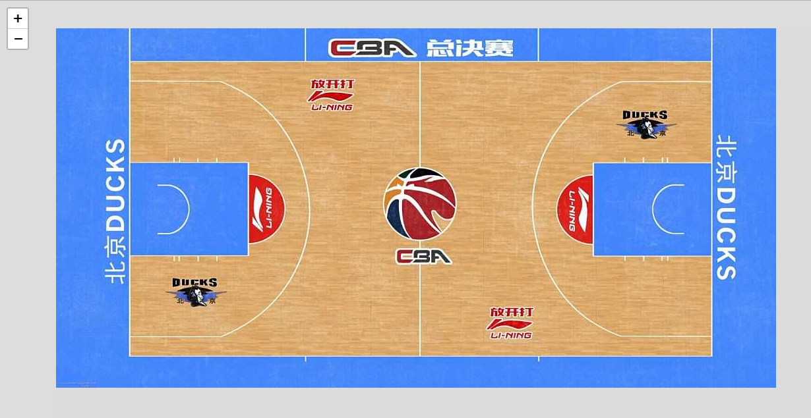

##  （三十二）离线地图

> **`1：瓦片地图原理`**
- `地图瓦片 - 256px * 256px`

    

    

- `瓦片坐标系统 - x/y/z`
    - `x,y - 当前瓦片位置`
    - `当前瓦片缩放级别`

- `第一级瓦片`

  

- `第二级瓦片`

  

- `瓦片地图优势`
    - `高效缓存`
    - `渐进加载`
    - `简单易用`

> **`2：Leaflet`**
- `显示地图`
    ```css
    var map = L.map('map').setView([51.505, -0.09], 13);

    L.tileLayer('https://{s}.tile.openstreetmap.org/{z}/{x}/{y}.png').addTo(map);
    ```

- `添加Marker、Popup`
    ```css
    L.marker([51.5, -0.09]).addTo(map)
        .bindPopup('FirstMarker')
        .openPopup();
    ```

- `添加线条`
    ```css
    var latlngs = [
        [51.5, -0.09],
        [55.5, -1.09],
        [56.5, -2.09]
    ];
    var polyline = L.polyline(latlngs, {
        color: 'red'
    }).addTo(map);
    ```
- `添加多边形`
    ```css
    var latlngs = [
        [50, 0],
        [51, -1],
        [52, -2],
        [51, -3]
    ];
    var polygon = L.polygon(latlngs, {
        color: 'red'
    }).addTo(map);
    ```

> **`3：离线地图`**

  

> **`4：其他应用`**

  

  

  

> **`5：总结`**
```css
本节课介绍了瓦片地图原理(标准), 介绍了比较流行地图离线插件Leaflet的基本使用。
```