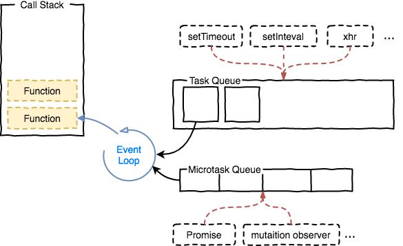

##  （四十）JavaScript调用栈

> **`1：基本概念`**
- `单线程模型`

- `Event Loop`

    

- `宏任务 - Macro-task`
    - `setTimeout`

    - `setInterval`

    - `I/O`
- `微任务 - Micro-task`

     - `promise`

> **`2：Event Loop`**

- `所有同步任务都在主线程上执行，形成一个执行栈`

- `主线程之外, 存在一个任务队列(task queue), 异步任务有了运行结果会在任务队列之中放置一个任务`

- `执行栈中的所有同步任务执行完毕后读取任务队列(先读取微任务、宏任务)`

- `不断重复上面的第三步`

    ```css
    console.log('script start');

    setTimeout(function() {
        console.log('timeout1');
    }, 10);


    new Promise(resolve => {
        console.log('promise1');

        resolve();

        setTimeout(() => console.log('timeout2'), 10);

    }).then(function() {
        console.log('then1')
    })

    console.log('script end');

    /*
    * script start
    * promise1
    * script end
    * then1
    * timeout1
    * timeout2
    */
    ```

> **`3：宏任务`**
- `由JavaScript线程外的宿主线程执行`
    - `定时触发器线程`

    - `异步HTTP请求线程`

- `JavaScript线程不空闲宏任务永远没有执行机会`
    ```css
    for(let i=0; i<100000000; i++) {}

    setTimeout(function() {
        console.log('setTimeout1');
    }, 1000);

    setTimeout(function() {
        console.log('setTimeout2');
    }, 2000);
    ```

> **`4：微任务`**
- `由JavaScript线程维护`

- `在主线程所有可执行代码执行完成后执行`

- `浏览器渲染Dom前会全部执行`

> **`5：课后练习`**
- `下列代码的输出结果是`
    ```css
    for (var i = 1;i <= 5;i ++) {
        setTimeout(function timer() {
            console.log(i)
        }, i * 1000)
    }
    ```
- `将上面代码稍作改动, 使其输出变为1、2、3、4、5`

- `下列代码的输出结果是`
    ```css
    console.log('global');

    setTimeout(function () {
        console.log('timeout1');
        new Promise(function (resolve) {
            console.log('timeout1_promise');
            resolve();
        }).then(function () {
            console.log('timeout1_then');
        })
    }, 2000)

    for (var i=1; i<=5; i++) {
        setTimeout(function() {
            console.log(i)
        }, i * 1000);
        console.log(i);
    }

    new Promise(function (resolve) {
        console.log('promise1');
        resolve();
    }).then(function () {
        console.log('then1');
    })

    setTimeout(function () {
        console.log('timeout2');
        new Promise(function (resolve) {
            console.log('timeout2_promise');
            resolve();
        }).then(function () {
            console.log('timeout2_then');
        })
    }, 1000)

    new Promise(function (resolve) {
        console.log('promise2');
        resolve();
    }).then(function () {
        console.log('then2');
    })
    ```


> **`6：总结`**
```css
本节课从JavaScript单线程模型出发, 介绍了浏览器环境下JavaScript线程的执行过程, 结合具体例子介绍了宏任务与微任务结合的执行过程
```