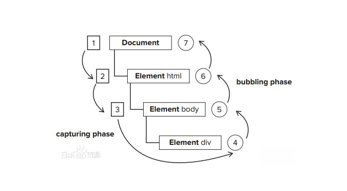

##  （四十五六）JavaScript自定义事件
> **`1：基本概念`**
- `系统内发生的动作或者发生的事情`

- `系统会在事件出现时触发某种信号`

- `提供一个自动加载某种动作的机制`

```css
var myButton = document.getElementById('button');

myButton.onclick = function() {
    alert('点击了button');
}

myButton = null;
```

> **`2：事件三要素`**
- `事件源 - 触发(被)事件的元素`

- `事件类型 - 事件的触发方式(例如鼠标点击或键盘点击)`

- `事件处理程序 - 事件触发后要执行的代码`

> **`3：事件冒泡(DOM)`**



- `触发阶段`

- `捕获阶段`

- `冒泡阶段`

> **`4：创建自定义事件`**
```javascript
var event = new Event('myEvent');
/*
var event = document.createEvent('Event');

event.initEvent('myEvent', true, true);
*/

myButton.addEventListener('myEvent', function (e) {
    debugger;
}, false);

myButton.dispatchEvent(event);
```

> **`5：添加自定义数据`**

```javascript
var event = new CustomEvent('myEvent', { 'detail': {
    time: new Date().toLocaleDateString()
} });

myButton.addEventListener('myEvent', function (e) {
    debugger;
}, false);

myButton.dispatchEvent(event);
```
> **`6：仿JQ封装自定义事件(标准浏览器)`**
```javascript
var $ = function(el) {
    return new _$(el);    
};

var _$ = function(el) {
    this.el = (el && el.nodeType === 1)? el: document;
};

_$.prototype = {
    constructor: _$,
    addEvent: function(type, fn, capture) {
        var el = this.el;
        
        if (window.addEventListener) {
            el.addEventListener(type, fn, capture);

            var ev = document.createEvent("HTMLEvents");
            ev.initEvent(type, capture || false, false);
        }
        
        return this;
    },
    fireEvent: function(type) {
        var el = this.el;
        if (typeof type === "string") {
            if (document.dispatchEvent) {
                if (el["ev" + type]) {
                    el.dispatchEvent(el["ev" + type]);
                }
            }  
        }    
        return this;
    },
    removeEvent: function(type, fn, capture) {
        var el = this.el;
        if (window.removeEventListener) {
            el.removeEventListener(type, fn, capture || false);
        }
        return this;    
    }
};
```

> **`7：总结`**
```css
本节课介绍了Javascript中事件的基本概念及特点, 通过两个例子介绍了自定义事件的使用方法, 最后结合仿照JQ实现一个事件绑定对象
```