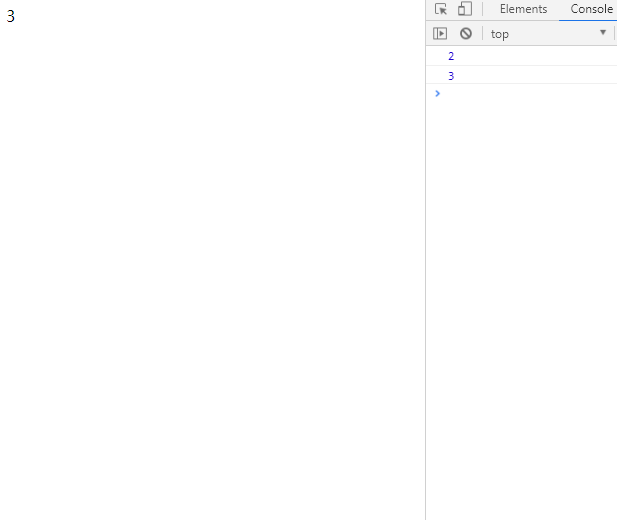

##  （五十九）ES6新特征 - Reflect

> **`1：基本概念`**
- `内置的对象, 提供拦截 JavaScript 操作的方法`

- `将部分属于语言内部的方法转移到Reflect - defineProperty`

- `优化了部分函数的返回结果`

- `调用风格上倾向于函数式编程`

- `保留对象的默认行为 - Proxy`

- `没有构造函数, 所有属性方法都为静态 - 类似Math`

> **`2：静态方法`**
- `get - 取值操作, 不存在返回undefined`
  ```javascript
  Reflect.get(target, propertyKey[, receiver]);
  ```
  - `内部this绑定receiver`
  ```javascript
  var object1 = {
    a: 1,
    b: 2,
    get c() {
      return this.a + this.b;
    },
  };

  var object2 = {
    a: 4,
    b: 4,
  };

  Reflect.get(object1, 'c');
  /* 3 */
  Reflect.get(object1, 'c', object2);
  /* 8 */
  ```


- `set - 赋值操作`
  ```javascript
  Reflect.set(target, propertyKey, value[, receiver]);
  ```

  - `内部this绑定receiver`
  ```javascript
  var object1 = {
    a: 1,
    set b(value) {
      return this.a = value;
    },
  };

  var object2 = {
    a: 0,
  };

  Reflect.set(object1, 'b', 2, object2);
  object1.foo
  /* 1 */
  object2.foo;
  /* 2 *
  ```
  - `与Proxy同时使用 - 传递receiver会触发defineProperty`
  ```javascript
  let object = {
    a: 1
  };

  let handler = {
    set(target, key, value, receiver) {
      console.log('set value', value);
      Reflect.set(target, key, value, receiver)
    },
    defineProperty(target, key, attribute) {
      console.log('defineProperty', attribute);
      Reflect.defineProperty(target, key, attribute);
    }
  };

  let obj = new Proxy(object, handler);
  obj.a = 2;
  ```
- `has - 对象是否包含某个属性 - 返回布尔值`
  ```javascript
  Reflect.has(target, propertyKey);
  ```
  ```javascript
  var object = {
    a: 1,
  };

  Reflect.has(object, 'a');
  /* true */
  ```
- `deleteProperty - 删除某个属性 - 返回布尔值`
  ```javascript
  Reflect.deleteProperty(target, propertyKey)
  ```
  ```javascript
  var object = {
    a: 1,
  };

  Reflect.deleteProperty(object, 'a');
  /* true */
  ```
- `construct - new操作`
  ```javascript
  Reflect.construct(target, argumentsList[, newTarget]);
  ```
  ```javascript
  function Teacher(name) {
    this.name = name;
  }

  const eric = Reflect.construct(Teacher, ['Eric']);
  /* Teacher {name: "Eric"} */
  ```
- `getPrototypeOf - 读取__proto__属性`
  ```javascript
  Reflect.getPrototypeOf(target);
  ```
  ```javascript
  function Teacher(name) {
    this.name = name;
  }
  const eric = Reflect.construct(Teacher, ['Eric']);

  Reflect.getPrototypeOf(eric) === Teacher.prototype;
  /* true */
  ```
- `setPrototypeOf - 设置目标对象原型 - 返回布尔值`
  ```javascript
  Reflect.setPrototypeOf(target, prototype);
  ```
  ```javascript
  const object = {};

  Reflect.setPrototypeOf(object, Array.prototype);

  object.length;
  /* 0 */
  ```
- `apply - 绑定this对象执行给定函数`
  ```javascript
  Reflect.apply(target, thisArgument, argumentsList);
  ```
  ```javascript
  const list = [1, 2, 3, 4, 5, 6];

  const min = Reflect.apply(Math.min, Math, list);
  ```
- `defineProperty - 对象定义属性`
  ```javascript
  Reflect.defineProperty(target, propertyKey, attributes);
  ```
  ```javascript
  let object = {};

  Reflect.defineProperty(object, 'name', {
    value: 'Eric'
  });
  /* {name: "Eric"} */
  ```
- `getOwnPropertyDescriptor - 获取指定属性的描述对象`
  ```javascript
  Reflect.getOwnPropertyDescriptor(target, propertyKey);
  ```
- `isExtensible - 返回指定对象是否可扩展`
  ```javascript
  Reflect.isExtensible(target);
  ```
- `preventExtensions - 阻止对象扩展`
  ```javascript
  Reflect.preventExtensions(target);
  ```
  ```javascript
  var empty = {};
  Reflect.isExtensible(empty);
  /* true */

  Reflect.preventExtensions(empty);
  Reflect.isExtensible(empty);
  /* false */
  ```
- `ownKeys - 返回对象的所有属性(包含Symbol)`
  ```javascript
  Reflect.ownKeys(target)
  ```
  ```javascript
  var object = {
    a: 1,
    b: 2,
    [Symbol.for('c')]: 3,
    [Symbol.for('d')]: 4,
  };

  Reflect.ownKeys(object);
  /* ["a", "b", Symbol(c), Symbol(d)] */
  ```

> **`4：课后练习`**
- `利用Relfect与Proxy实现一个最简单的数据绑定`


```javascript
const queue = new Set();

const observe = fun => queue.add(fun);

const observable = obj => new Proxy(
    obj,
    {
        /* ... */
    }
);

let data = {
    count: 1,
}

const update = () => {
    document.getElementById('app').innerHTML = data.count;
}

const observeData = observable(data);

observe(update);

setInterval(() => {
    observeData.count++;
    console.log(data.count);
}, 500);
```

> **`5：总结`**
```css
本节课介绍了ES6新特征中Reflect的基本概念与常见的静态方法
```