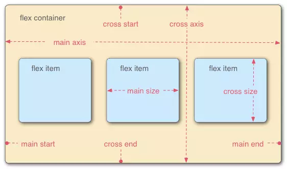

##  （六）Flex弹性盒模型

> **1：基本概念**

- **2009年W3C新方案—-Flex 布局 (弹性盒子模型), 可以简便、完整、响应式地实现各种页面布局**

- **Flex布局元素为Flex容器 (flex container), 子元素为容器成员 (flex item)**

- **容器默认存在两根轴**
	- 水平主轴 (main axis)
		- main start
		- main end
	- 垂直交叉轴 (cross axis)
		- cross start
		- cross end

	

- **默认沿主轴排列**
- **单个容器成员占据的主轴空间叫做main size, 占据的交叉轴空间叫做cross size**

> **2：发展历程**
  - **最老版本**
	- box (弹性伸缩盒)

	- inline-box (内联块级弹性伸缩盒)
  - **过渡版本**
	- flexbox (弹性伸缩盒)

	- inline-flexbox (内联块级弹性伸缩盒)
  - **最新版本**
	- flex (弹性伸缩盒)

	- inline-flex (内联块级弹性伸缩盒)

> **3：容器 (flex container) 属性**
   ```css
	flex-direction

	flex-wrap

	flex-flow

	justify-content

	align-items

	align-content
  ```
  - **flex-direction (决定主轴方向)**
	- row (横向从左到右排列 - 左对齐)

	- row-reverse (反转横向排列 - 右对齐)

	- column (纵向排列)

	- column-reverse (反转纵向排列)
	```css
	.main {
	    display: flex;
	    flex-direction: row; 
	}
	```
  - **flex-wrap (换行)**
	- nowrap (子元素溢出时不换行)

	- wrap (子元素溢出时自动换行)

	- wrap-reverse (反转 wrap 排列)
	```css
	.main {
	    display: flex;
	    flex-wrap: nowrap; 
	}
	```
  - **flex-flow (flex-direction与flex-wrap简写)**
	```css
	.main {
	    display: flex;
	    flex-flow: wrap row;
	}
	```
  - **justify-content (容器成员 (flex item) 主轴上的对齐方式)**
	- flex-start (主轴起始位置对齐 - 左对齐)

	- flex-end (主轴结束位置对齐 - 右对齐)

    - center (主轴中间位置对齐 - 居中)
		- 未溢出：第一个元素与主轴起始位置的边距 === 最后一个元素与主轴起始位置的边距

		- 溢出：第一个元素溢出 === 最后一个元素溢出
	- space-between (平均地分布在主轴上)
		- 未溢出：两两之间间隔相等

		- 溢出
			- 只有一个子元素 (flex-start)

			- 最左边的剩余空间是负数 (flex-start)
	- space-around (平均地分布在主轴上, 两端保留子元素与子元素之间间距大小的一半)
		- 未溢出

		- 溢出
			- 只有一个子元素 (center)

			- 最左边的剩余空间是负数 (center)
	- space-evenly (平均地分布在主轴上, 两端保留子元素与子元素之间间距相同间距)
		- 未溢出

		- 溢出
			- 只有一个子元素 (center)

			- 最左边的剩余空间是负数 (center)
	```css
	.main {
	    display: flex;
	    justify-content: center; 
	}
	```
  - **align-items (容器成员 (flex item) 交叉轴上的对齐方式)**
	- stretch (拉伸容器成员 (flex item) 适应容器 - 默认属性)
	- flex-start (交叉轴起始位置对齐 - 上对齐)

	- flex-end (交叉轴结束位置对齐 - 下对齐)

    - center (交叉轴中间位置对齐 - 居中)
		- 未溢出：容器成员上边距交叉轴起始位置距离 === 容器成员上边距交叉轴起始位置距离

		- 溢出：两个方向溢出相同的长度
	- baseline (容器成员 (flex item) 基线对齐)
	```css
	.main {
	    display: flex;
	    align-items: center; 
	}
	```
  - **align-content (多根轴线的对齐方式, 单轴线不起作用 - 每一根轴线理解为一个容器成员 (flex item))**
	- flex-start

	- flex-end

	- center

	- space-between

	- space-around

	- stretch

> **3：容器成员 (flex item) 属性**
  ```css
	order

	flex-grow

	flex-shrink

	flex-basis

	flex

	align-self
  ```
  - **order (容器成员排列顺序 - integer)**
	- 0 (默认 - 数值越小, 排列越靠前, 可以为负值)
	```css
	.item {
	    order: 1;
	}
	```
  - **flex-grow (容器成员放大比例 - number)**
	- 0 (默认 - 数值越大, 占据的剩余空间越大, 不允许负值)
	```css
	.item {
	    flex-grow: 1;
	}
	```
  - **flex-shrink (容器成员缩小比例 - number)**
	- 1 (默认 - 数值越大, 压缩比例越大, 不允许负值)
	- 最小宽度制约
	```css
	.item {
	    flex-shrink: 0;
	}
	```
  - **flex-basis (分配多余空间之前，容器成员占据的主轴空间)**
	- auto (容器成员原本大小)
	- px
	- %
	```css
	.item {
	    flex-basis: 50px;
	}
	```
- **flex (flex-grow, flex-shrink 和 flex-basis的简写)**
	- 顺序
	- auto - (1 1 auto)
	- none - (0 0 auto)
	- 1 - (1 1 auto)
	```css
	.item {
	    flex: auto;
	}
	```
- **align-self (允许单个容器成员有与其他容器成员不同的对齐方式)**
	- auto (默认)
	- flex-start
	- flex-end
	- center
	- baseline
	- stretch
	```css
	.item {
	    align-self: auto;
	}
	```

> **4：课后练习`**

- 换成800px为什么左右边宽度变成了2
- flex-basic后面添加了width为什么会失效（选择）
- flex-basic受到min与max制约吗（选择）
- 一道计算题计算出flex各个元素宽度
```css

```

> **`6：总结`**

```
本节课讲解了CSS的发展历史、四种布局方式、以及CSS预处理器主要功能，最后介绍了常见的三种CSS预处理器
```