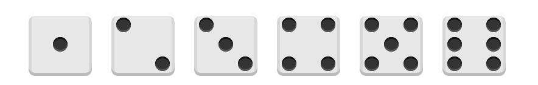

##  （七）弹性盒模型 (Flexbox) 常见例子

> **1：属性回顾**

- **flex container**
	```css
	flex-direction

	flex-wrap

	flex-flow

	justify-content

	align-items

	align-content
  ```

- **flex item**
	```css
	order

	flex-grow

	flex-shrink

	flex-basis

	flex

	align-self
  ```

> **2：垂直居中对齐**
- **不使用Flexbox**
	```css
	/* transform */
	position: absolute;
	left: 50%;
	top: 50%;
	transform: translate(-50%, -50%);

	/* margin */
	margin: auto;
	position: absolute;
	top: 0;
	left: 0;
	bottom: 0;
	right: 0;

	/* table */
	/* IE8推出的标准 比较早期的布局技术 */
	display: table-cell;
    vertical-align: middle;
    text-align: center;    

	/* -margin */
	width: 100px;
    height: 100px;
    position: absolute;
    left: 50%;
    top: 50%;
    margin: -50px 0 0 -50px;
	```
- **使用Flexbox**
	```css
	display: flex;
	justify-content: center;
    align-items: center;
	```
> **2：自适应导航**
- **不使用Flexbox**
	```css
	.main {
	    text-align: right;
	}
	.main li {
	    display: inline-block;
    }

	/* 小于800px 大于600px */
	@media screen and (max-width: 800px) {
	    .main {
		    text-align: justify;
            text-align-last: justify;
	    }
	}

	/* 小于600px */
	@media screen and (max-width: 600px) {
	    .main li {
	        display: block;
        }
        .main a {
	        display: block;
	        text-align: center;
	        text-align-last: center;
        }
	}
	```
- **使用Flexbox**
	```css
	.main {
	    display: flex;
	    flex-flow: row wrap;
	    justify-content: flex-end;
	}

	/* 小于800px 大于600px */
	@media screen and (max-width: 800px) {
	    .main {
		    justify-content: space-between;
	    }
	}

	/* 小于600px */
	@media screen and (max-width: 600px) {
	    .main {
		    flex-flow: column nowrap;
	    }
	}
	```
> **3：圣杯布局**
- **不使用Flexbox**
	```css
	.left,
	.middle,
	.right {
	    position: relative;
	    float: left;
	}

	.container {
		padding:0 200px 0 200px;
	}

	.left {
	    margin-left: -100%;
	    left: -200px;
	    width: 200px;
	}
	.right {
	    margin-left: -200px;
	    right: -200px;
	    width: 200px;
	}
	.middle { 
	    width: 100%;
	}
	```
- **使用Flexbox**
	```css
	.flex {
	    display: flex;
		flex-wrap: nowrap;
	}
	.leftBar {
	    width: 200px;
	    flex-shrink: 0;
	}
	.container {
	    width: 100%;
	}
	.rightBar {
	    width: 200px;
	    flex-shrink: 0;
	}
	```

> **4：课后练习**
- 使用Flexbox实现下图样式

	
	```css
	/* 骰子外阴影 */
	box-shadow:
	    inset 0 5px white, 
	    inset 0 -5px #bbb,
	    inset 5px 0 #d7d7d7, 
	    inset -5px 0 #d7d7d7;

	/* 骰子点数阴影 */
	box-shadow: inset 0 3px #111, inset 0 -3px #555;
	```
- 总结这两节课使用Flexbox感受
> **5：总结**

```
本节课从三个例子入手( 垂直居中、响应式、圣杯 )介绍了Flexbox的主要应用场景, 并与传统方式对比, 感受Flexbox布局带来的便捷开发体验
```