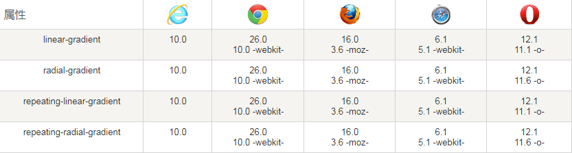
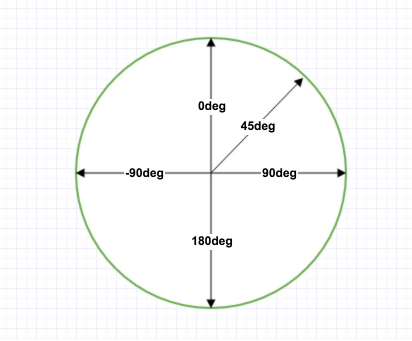
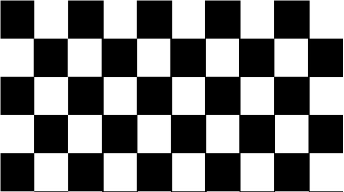
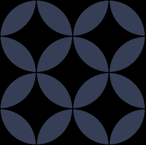

##  （八）CSS3渐变

> **`1：基本概念`**

- **在两个或多个指定的颜色之间显示平稳的过渡**

	

- **渐变效果由浏览器生成**

- **渐变类型**
	- 线性渐变 (Linear Gradients) - 向下/向上/向左/向右/对角方向

	- 径向渐变 (Radial Gradients) - 由它们的中心定义

- **作为元素的 background-image( background ) 使用**

> **`2：浏览器支持`**
  - **完全支持该属性的第一个浏览器版本**

	

  - **浏览器前缀**
	```css
	.header {
	    /* Safari */
	    background: -webkit-linear-gradient(red, blue);
	    /* Opera */
	    background: -o-linear-gradient(red, blue);
	    /* Firefox */
	    background: -moz-linear-gradient(red, blue);
	    /* 标准的语法, 放在最后 */
	    background: linear-gradient(red, blue);
	}
	```

> **`3：线性渐变 (Linear Gradients)`**

- **基本语法**

	```css
	background-image: linear-gradient([[<angle> | to <side-or-corner> ],]?<color-stop>[,<color-stop>]+);
	```

- **从上到下 - 默认方向**
	```css
	background-image: linear-gradient(#147B96, #E6D205);
	```

- **从左到右**
	```css
	to top/bottom/left/right

	background: linear-gradient(to right, #147B96, #E6D205);
	```

- **对角**
	```css
	to left top/left bottom/right bottom/right top

	background: linear-gradient(to bottom right, #147B96 , #E6D205);
	```

- **使用角度**

	
	```css
	background: linear-gradient(45deg, #147B96 , transparent);
	```

- **多种颜色**
	```css
	background-image: linear-gradient(to right, #147B96, #E6D205 25%, #147B96 50%, #E6D205 75%, #147B96);
	background-image: linear-gradient(to right, #147B96, #E6D205 50px, #147B96 50px, #E6D205 50px, #147B96);
	```

- **重复渐变**
	```css
	background-image: repeating-linear-gradient(to right, #147B96, #E6D205 5%, #147B96 10%, #E6D205 20%, #147B96);
	```

- **声明多个 - 逗号分隔 - 最先声明优先级最高**
	```css
	background: linear-gradient(green 10px, transparent 10px),
				linear-gradient(90deg,green 10px, transparent 10px) repeat left top / 40px,
				linear-gradient(transparent 40px, green 4px);
	```

> **`4：线性渐变实例`**
- **炫彩文字**
	```css
	.linear {
        color: green;
        background-image: linear-gradient(
            to left,
            rgb(16, 121, 148), 
            rgb(230, 211, 13) 25%, 
            rgb(18, 136, 165) 50%, 
            rgb(231, 213, 10) 75%, 
            rgb(16, 121, 148)
        );
        background-size: 200% 100%;
        -webkit-text-fill-color: transparent;
        -webkit-background-clip: text;
        animation: mask 4s infinite linear;
    }
	@keyframes mask {
        0%  { background-position: 0 0;}
        100% { background-position: -100% 0;
	}
	```
- **特殊图形**
	```css
	background: linear-gradient(-60deg, blue 50%, transparent 0) no-repeat top left / 50% 50%,
                linear-gradient(60deg, blue 50%, transparent 0) no-repeat top right / 50% 50%,
                linear-gradient(-120deg, blue 50%, transparent 0) no-repeat bottom left / 50% 50%,
                linear-gradient(120deg, blue 50%, transparent 0) no-repeat bottom right / 50% 50%;
	```

> **`5：径向渐变 (Radial Gradients)`**
- **基本语法**
	```css
	background-image: radial-gradient([[<shape> || <size>] [at <position>]?,| at <position>,]?<color-stop>[,<color-stop>]+);
	```
	- **渐变中心 - 中心点**
		- 30px (20%) 20px (30%) - 左侧30px (30%)距离上侧20px (20%)
		```css
		ackground-image: radial-gradient(0% 0%, red, green, blue);
		```
	- **渐变形状 -  ellipse (椭圆形)**
		- circle
		- ellipse
		```css
		background-image: radial-gradient(circle at farthest-corner, red, green, blue);
		```
	- **渐变大小 - farthest-corner (最远)**
		- closest-side - 渐变的半径长度为从圆心到离圆心最近的边
		- farthest-side - 渐变的半径长度为从圆心到离圆心最近的角
		- closest-corner - 渐变的半径长度为从圆心到离圆心最远的边
		- farthest-corner - 渐变的半径长度为从圆心到离圆心最远的角
		- ...
		```css
		background-image: radial-gradient(circle at farthest-corner, red, green, blue);
		```
- **多种颜色**
	```css
	...
	```
- **重复渐变**
	```css
	...
	```
- **声明多个 - 逗号分隔 - 最先声明优先级最高**
	```css
	...
	```


> **`6：课后练习`**
- 为什么针对Gradients属性特别推荐autoprefixer

- 利用Linear Gradients实现下列样式( 10px * 10px ) ( 10 * 5 )
	

- 利用Radial Gradients实现下列样式( 100px * 100px * 4)

	

> **`7：总结`**

```
本节课讲解了Linear Gradients与Radial Gradients的基本概念, 介绍了两种渐变的常用属性，最后结合了Linear Gradients实例介绍了CSS3渐变在实际中的部分应用场景
```