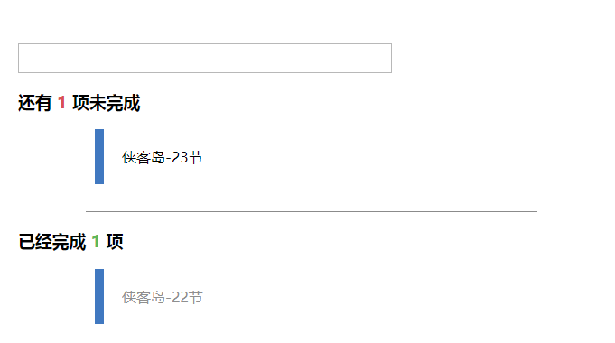

> **`使用LocalStorage实现下列TodoList`**

- `要求`
    - `输入框点击回车获取输入框中内容添加到未完成列表`
    - `未完成列表鼠标双击添加到已完成列表`

> **`使用IndexedDB实现下列TodoList`**

- `要求`
    - `输入框点击回车获取输入框中内容添加到未完成列表`
    - `未完成列表鼠标双击添加到已完成列表`