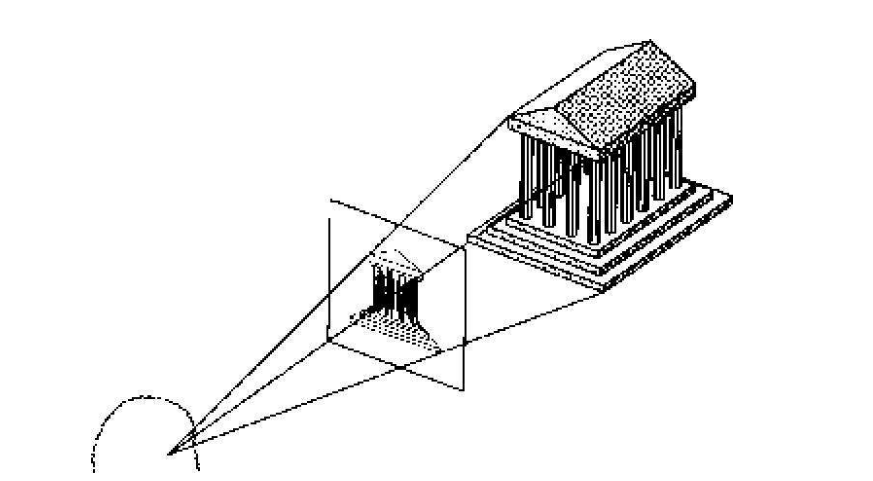
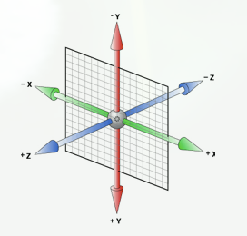

> **`1: 贝塞尔曲线`**

- `贝兹曲线或贝济埃曲线, 应用于二维图形应用程序的数学曲线`

- `http://cubic-bezier.com/` - 可视化cubic-bezier

- `绘制贝塞尔曲线`

    

    

    

    

    

    

- `函数形式的贝塞尔曲线`

    - 一阶贝塞尔曲线

      

      

    - 二阶贝塞尔曲线

      

      

    - 三阶贝塞尔曲线

      

      

- `cubic-bezier(n1, n2, n3, n4)`
    - P0 (0, 0)
    - P1 (1, 1)
    - P3 (n1, n2)
    - P4 (n3, n4)

- `曲线上点的切线对应运动速度`

  ```css
  transition-timing-function: linear | ease | ease-in | ease-out | ease-in-out | cubic-bezier(n1, n2, n3, n4);
  ```

- `默认值` - ease

- `n1、n2、n3、n4取值` - 官方推荐(0 - 1) - 实际浏览器已经完全支持

- `linear` - 以相同速度过渡 - cubic-bezier(0, 0, 1, 1) / cubic-bezier(1, 1, 0, 0)

    

- `ease` - 慢速开始 -> 变快 -> 慢速结束 - cubic-bezier(0.25, 0.1, 0.25, 1)

    

- `ease-in` - 慢速开始 - cubic-bezier(0.42, 0, 1, 1)

    

- `ease-out` - 慢速结束 - cubic-bezier(0, 0, 0.58, 1)

    

- `ease-in-out` - 慢速开始、慢速结束、幅度比ease大 - cubic-bezier(0.42, 0, 0.58, 1)

    

- `cubic-bezier(n, n, n, n)` - 自定义速度函数 (n介于0和1)

    

    

    `cubic-bezier(.5, 0, .5, 1)`

> **`2: Rotate3d`**

- **`透视投影`**

  

- **`坐标系` - 左手坐标系**

  

- `rotate3d(x, y, z, angle)` - 3D旋转
    - `x y z - 介于0-1之间, 确定三维空间唯一坐标点`

    - `angle - 围绕原点与x y z坐标点连线组成变量的旋转角度`

    - `欧拉角`
        - `由三个角度组成, 在特定坐标系下用于描述刚体的orientation`

            

    - `四元数`
        - `四元数减小一些算法的复杂度`

    ```css
    transform: rotate3d(1, 1, 1, 45deg);
    ```

> **`3: 速度交换`**
```javascript
function checkCollision(ball0, ball1) {
    // 获取两球球心距离
    const dx = ball1.x - ball0.x;
    const dy = ball1.y - ball0.y;
    const distance = Math.sqrt(dx * dx + dy * dy);

    if(distance < ball0.radius + ball1.radius) {
        // 小球速度分解
        const ball0_vx = ball0.vx;
        const ball0_vy = ball0.vy;

        // 大球速度分解 - 假定每一帧为基础时间单位
        const ball1_vx = ball1.vx;
        const ball1_vy = ball1.vy;

        // 根据碰撞速度公式计算碰撞后的速度
        // v1 = [(m1-m2)v10 + 2m2v20] / (m1+m2)
        // v2 = [(m2-m1)v20 + 2m1v10] / (m1+m2)
        // 默认密度相同，质量为3倍关系
        const m1 = ball0.radius / ball0.radius;
        const m2 = Math.pow(ball1.radius / ball0.radius, 3);
        const ball0_vx_new = [( m1 - m2 ) * ball0_vx + 2 * m2 * ball1_vx] / (m1 + m2);
        const ball0_vy_new = [( m1 - m2 ) * ball0_vy + 2 * m2 * ball1_vy] / (m1 + m2);

        const ball1_vx_new = [( m2 - m1 ) * ball1_vx + 2 * m1 * ball0_vx] / (m1 + m2);
        const ball1_vy_new = [( m2 - m1 ) * ball1_vy + 2 * m1 * ball0_vy] / (m1 + m2);

        ball0.vx = ball0_vx_new;
        ball0.vy = ball0_vy_new;
        ball1.vx = ball1_vx_new;
        ball1.vy = ball1_vy_new;
    }
}
```
