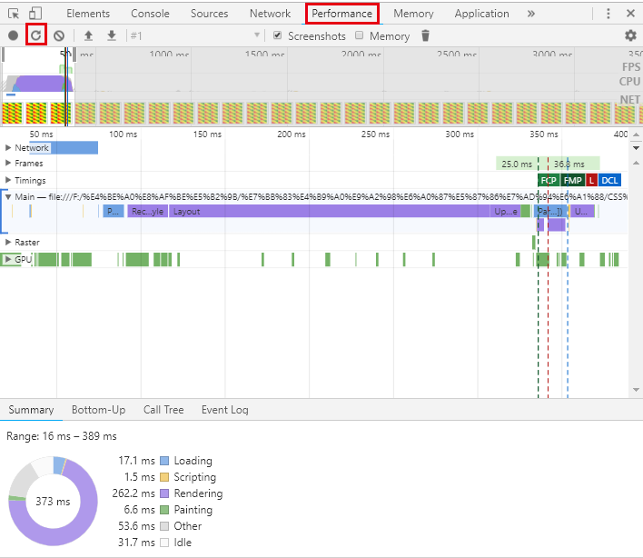

> 1 

    B - 计算间距时单独计算

> 2

    A

> 3

    B

> 4

    B、D

> 5

    A

> 6

    A

简答
> 1

    Flex弹性盒模型不具备Justify-items属性

> 2

    关键点：替代图片、节省带宽、提升清晰度

> 3

    关键点： Flex盒模型一维、Grid二维
            FLex移动端兼容性好
            Grid适合全局布局、Flex适合局部布局
            Grid适合处理不规则布局、Flex适合规则布局

> 4

    正交投影下用户与元素3d空间Z平面之间的距离，距离单位为px

实操

> 1

渐变表现稍好