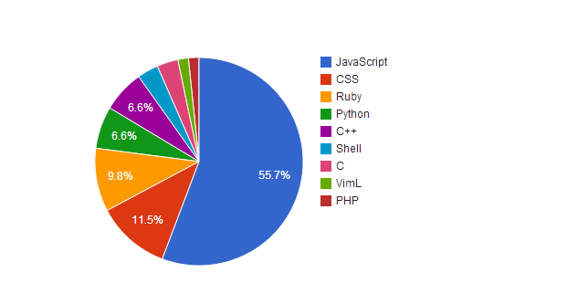
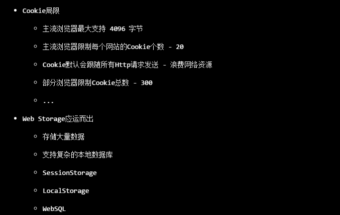
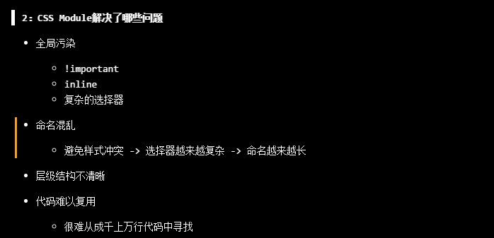
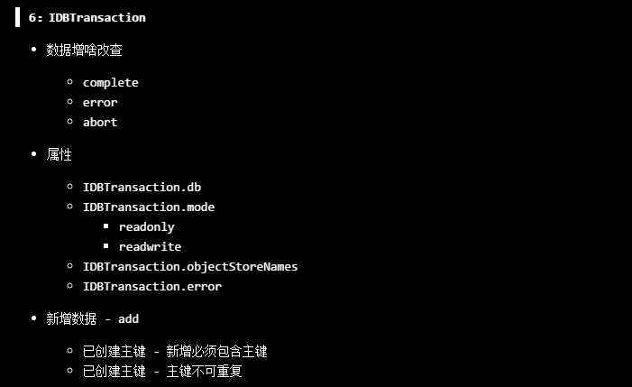
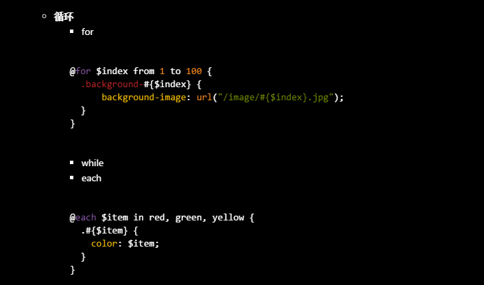
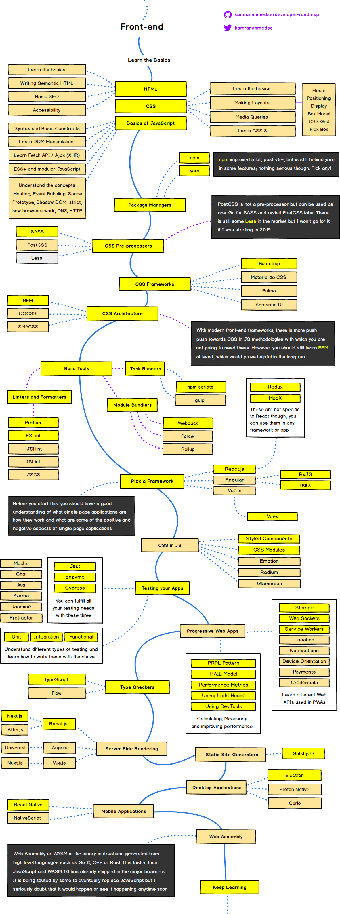

> `Web薪资`


> `Github代码统计`



> `课程优势`

- `Stay hungry Stay foolish.`
```css
任何一个技术的出现都是为了解决某些现实存在的问题，在这里我们寻根溯源，了解每一项技术的来龙去脉，一起探索技术的根源
```


- `Talk is cheap. Show me the code.`
```css
编程是一门实践与理论并行的学科，每节课配套的课后练习，源自于真正的应用场景，在这里追求的是更高层次的运用，拒绝简单重复
```


- `Done is better than perfect.`
```css
在这里，大到每一个章节，小到每一个知识点，力求百分百覆盖，拒绝一知半解，将每一个知识点学活学透
```



- `Go big or go home.`
```css
一切靠实力说话，在这里我们抛砖引玉，激发学习热情，培养学习能力，做成长路上的奠基石
```
  

  

> `课程内容`


